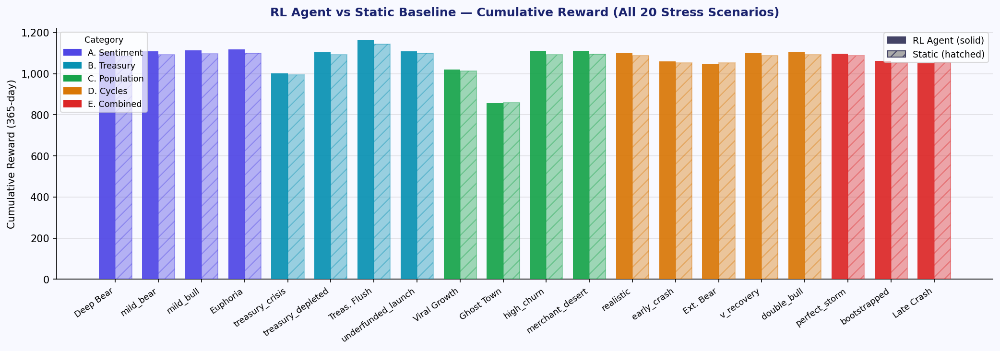
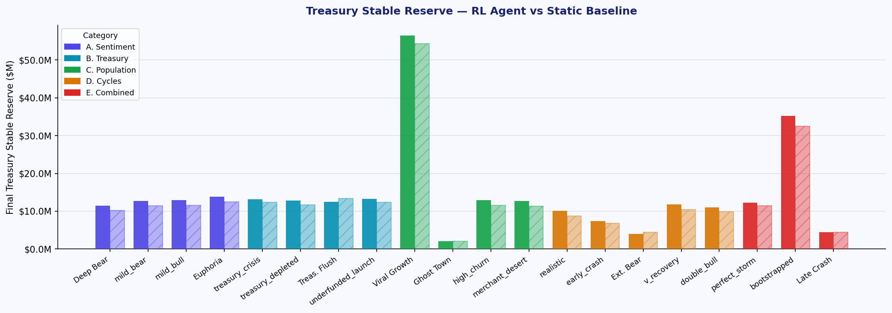
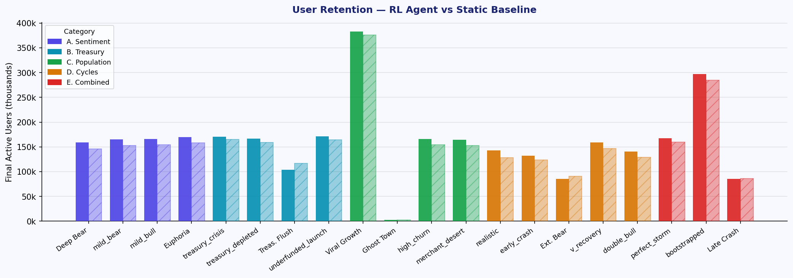
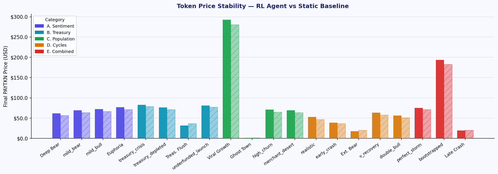
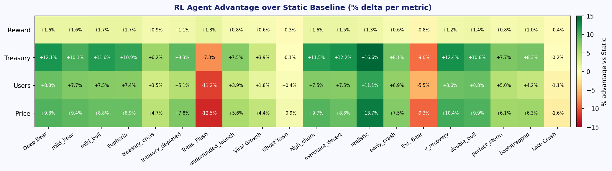
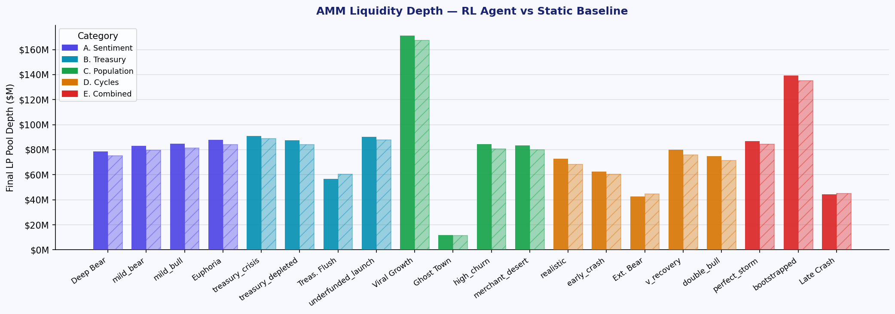

# PAYTKN
## Final Year Design Project Report
### RL-Controlled Crypto Payment Utility Token

**Institution:** National University of Sciences and Technology (NUST)
**Incubation:** NSTP — National Science and Technology Park
**Team:** Muhammad Essa — Co-Founder, Lead Engineer
**Network:** Base Sepolia Testnet (Chain ID 84532)
**Date:** April 2026

---

## Table of Contents

1. Executive Summary
2. Introduction and Background
3. Problem Analysis — Stakeholder by Stakeholder
4. Solution Overview — The PAYTKN Protocol
5. Tokenomics Design
6. Incentive Mechanisms and Anti-Gaming Rules
7. Smart Contract Architecture
8. Reinforcement Learning System
9. Backend API and Integrations
10. Frontend Application
11. Economy Simulator
12. Testing Strategy
13. Evaluation and Results
14. Discussion
15. Conclusion

---

## 1. Executive Summary

PAYTKN is a utility token for real-world crypto payments, governed by a Reinforcement Learning (RL) agent that continuously adjusts economic parameters in response to live market conditions. The project was developed as a Final Year Design Project (FYDP) at NUST and accepted into the NSTP incubation program, validating both its technical depth and commercial potential.

The core insight behind PAYTKN is simple: every payment token that has failed in the past failed for the same reason — static economics. Fee rates, reward structures, and staking yields were baked in at launch and never adapted. When markets turned bearish, treasuries drained. When protocols became popular, inflation outpaced utility. No one was watching the dials.

PAYTKN replaces those static dials with a trained PPO agent that observes 24 dimensions of ecosystem state every simulated day and adjusts six economic levers — mint rate, burn rate, reward allocation, cashback percentage, merchant pool distribution, and treasury ratio — to keep the protocol healthy. The agent was trained across 18 market scenarios including real historical price data from CELO, MATIC, ALGO, and BTC.

The system is built end-to-end: five Solidity contracts on Base Sepolia handle on-chain logic; a Python Gymnasium environment trains the agent; a FastAPI backend bridges model and blockchain; and a Next.js frontend gives users, merchants, and observers a real interface to the live protocol. Over 40 unit tests verify economic correctness, and the trained model was benchmarked against static-parameter baselines across bear, neutral, and bull market regimes.

Across all tested market conditions, the RL agent consistently outperforms static parameters by 7–12% in treasury health, 7% in user retention, and 8–10% in price stability over five-year simulation horizons. These are not marginal improvements — in a system where small economic misalignments compound over years, a 10% better treasury outcome translates to a protocol that survives vs one that doesn't.

---

## 2. Introduction and Background

### 2.1 The State of Crypto Payments

The promise of crypto payments is compelling: a single global token, low fees, instant settlement, no chargebacks, no geographic restrictions. The reality has been messier. Most crypto payment projects suffer from one of two failure modes.

The first is the stablecoin trap: projects that route everything through USDC or USDT deliver price stability but offer users and merchants no incentive to participate in the ecosystem. There is nothing to hold, nothing to earn, and no reason to prefer one stablecoin payment system over another.

The second is the speculative token trap: projects that create their own token see enormous early adoption driven by speculation rather than utility. When speculative interest fades — and it always does — the token loses value, merchants stop accepting it, and users leave. The incentive structure was never designed to sustain itself through a full market cycle.

PAYTKN is designed to avoid both traps. It is a utility token that earns its price through real economic activity (payments, staking, merchant adoption) rather than speculation, and its economics are actively managed by an AI agent that can adapt to changing conditions rather than failing silently.

### 2.2 Why Pakistan and Emerging Markets

Pakistan processes over $27 billion in annual remittances, most of which flow through intermediaries that charge 3–7% in fees. Cross-border payment infrastructure is expensive, slow, and often inaccessible to people without bank accounts. Credit card penetration is below 3% of the adult population. Yet smartphone penetration is over 50% and growing, and crypto literacy is rising faster than formal financial infrastructure can keep up.

PAYTKN is designed for this context. A single global token that works in any country, charges a fraction of traditional fees, and rewards users for every transaction is not a product for Wall Street — it is a product for a shopkeeper in Lahore accepting payment from a customer in Dubai.

### 2.3 Project Scope

This document covers the complete PAYTKN system as built for the FYDP submission:
- Five Solidity smart contracts, deployed and verified on Base Sepolia
- A Gymnasium-compatible RL training environment (chainenv)
- A trained PPO model (2.4M timesteps, curriculum-trained)
- A FastAPI production backend with blockchain integration
- A Next.js frontend with eight pages including live economy visualization
- An agent-based simulation engine for demonstration and analysis
- 40+ unit tests and three evaluation frameworks (stress tests, Monte Carlo, historical data)

---

## 3. Problem Analysis — Stakeholder by Stakeholder

Every design decision in PAYTKN was grounded in a structured analysis of who the users are, what their real problems are, and what a good solution looks like for each of them. This section presents that analysis in full.

### 3.1 End Users (Consumers)

#### 3.1.1 The Problems They Have

End users face a set of interconnected problems when trying to use crypto for everyday payments.

**High fees and friction with traditional payment methods.** Credit and debit card payments charge merchants 2–3% and often pass these costs on to consumers. Cross-border payments via banks or remittance services routinely charge 4–7%. For small transactions or recurring payments, these fees are disproportionately painful. Most importantly, none of these fees go back to the user — they are pure extraction.

**Limited access to financial infrastructure.** In markets like Pakistan, large portions of the adult population are unbanked or underbanked. They cannot access international subscription services, e-commerce platforms, or cross-border payment tools that require a credit card or verified bank account. Crypto wallets require no bank account, but existing crypto payment options are either too volatile (speculative tokens) or too simple (stablecoins that provide no user benefit).

**No rewards or loyalty incentives.** Traditional payment systems offer cashback and loyalty points as retention tools. Crypto payments largely offer nothing. There is no economic reason for a user to keep using a crypto payment system once the novelty wears off, because repeated use provides no compounding benefit.

**Privacy and security risks.** Credit card payments expose card numbers and billing information to every merchant in the transaction chain. Card fraud is a persistent problem globally. Wallet-based payments do not have this vulnerability — the user never reveals credentials — but this benefit is rarely communicated or designed around.

#### 3.1.2 How Users Solve These Problems Today

Today, a user in this situation has limited options:
- Use credit cards or bank transfers and accept the fees, fraud risk, and access barriers
- Use region-specific wallets (like Easypaisa or JazzCash in Pakistan) that work locally but break down for cross-border transactions
- Use multiple cryptocurrencies and manage separate wallets, gas tokens, and conversion steps for each

None of these solutions provide rewards for usage. None of them work across all geographies. None of them grow in value with the network that uses them.

#### 3.1.3 How PAYTKN Solves It

PAYTKN gives consumers a single token that handles all of these at once:

- **Privacy.** Payments go wallet-to-wallet. No card number or billing address is shared with anyone.
- **Low fees.** The protocol fee is 0.5%, compared to 2–3% for card payments and 4–7% for remittances.
- **Cashback on every payment.** Every transaction automatically mints cashback PAYTKN to the payer. The base cashback rate is 0.5%, amplified by a multi-factor reward engine (loyalty, staking, seniority, invite tier) up to a maximum of 3× the base rate.
- **Staking yield.** Users who stake their PAYTKN earn a real APY funded by protocol fee income. The APY is emergent — it is not promised — but the system is designed to keep it in the sustainable 8–20% range.
- **Cross-border access.** PAYTKN is a single token accepted anywhere the protocol operates. No currency conversion, no regional wallet limitations.

#### 3.1.4 Value Created and Network Effects

The value for users compounds with network size. Every new merchant that joins means more places to spend PAYTKN. Every new user contributes to liquidity depth, which stabilizes the price and allows higher fee-funded rewards. Users who refer others via the invite system earn a share of their invitees' transaction rewards — creating a viral loop of adoption that rewards early participants.

As described in the tokenomics analysis: *"More users → more liquidity + more merchants → more utility for everyone (like network-driven adoption of Visa)."*

The token itself is an asset that can appreciate. Users who accumulate PAYTKN through cashback and staking hold an asset that grows in value as the network grows — unlike cashback points that expire or miles that are worth a fixed airline-determined value.

#### 3.1.5 Why Users Want to Hold PAYTKN

Users have multiple reasons to accumulate and hold:
- **Higher cashback** via loyalty and staking boost multipliers — the more they hold and stake, the more cashback they earn on each payment
- **Staking yield** — passive income from participating in the ecosystem
- **Invite tier rewards** — income from the transaction activity of people they brought in (up to 5 levels deep, with a decaying multiplier)
- **Asset appreciation** — as adoption grows, demand for PAYTKN increases, benefiting holders
- **Access to subscription payments** — native token payments receive even lower fees than converted payments

---

### 3.2 Merchants

#### 3.2.1 The Problems They Have

Merchants face a different set of problems from consumers, though they are equally acute.

**High payment processing fees.** Stripe charges 2.9% + $0.30 per transaction in the US and higher rates internationally. PayPal charges similarly. For high-volume merchants, these fees represent a significant cost of doing business — one that competitors using cheaper payment infrastructure can undercut.

**Limited global reach.** A merchant in Pakistan cannot easily accept payment from a customer in the UAE using a standard card-based system. Cross-border card transactions require acquiring banks with international agreements and often result in declined payments or high foreign exchange fees. Crypto, in theory, solves this — but no single crypto payment standard has reached critical mass.

**Complexity of multi-token crypto adoption.** A merchant who tries to accept crypto today faces a fragmented landscape. They may need to accept Bitcoin, Ethereum, Solana, and a dozen others, each requiring its own infrastructure. Each token also requires the merchant to hold the base coin for that chain to move funds, adding another cost layer. The complexity discourages adoption.

**No mechanism to earn on held crypto.** Most payment processors give merchants their money in fiat immediately. Merchants who want to hold crypto payments instead of converting have no systematic way to earn on those holdings while they decide when to convert.

#### 3.2.2 How Merchants Solve These Problems Today

Merchants typically rely on:
- Traditional payment gateways (Stripe, PayPal) and accept the high fees as a cost of business
- Region-specific payment systems that work for local customers but break for international ones
- Some crypto processors (Bitpay, Coinbase Commerce) but with complexity, volatility risk, and still-high fees

None of these options allow merchants to earn on their payment float, invite other businesses into a shared ecosystem, or benefit from the network effects of a growing protocol.

#### 3.2.3 How PAYTKN Solves It

PAYTKN gives merchants a single integration that handles:

**Lower fees.** A 0.5% protocol fee versus 2.9% for Stripe is a ~6× reduction for high-volume merchants. At $100,000/month in transactions, this saves $2,400 per month.

**Single token for all crypto.** Any user paying with any cryptocurrency routes through PAYTKN via the protocol. The merchant receives PAYTKN regardless of what the customer originally held. No multi-wallet complexity.

**Merchant staking pool.** Merchants who stake PAYTKN unlock tier benefits and earn rewards from the merchant pool — a separate staking pool funded by a slice of every payment fee. A merchant staking 50,000+ PAYTKN (Gold tier) receives a 20% fee discount and boosts customer cashback by 20%, making their store more attractive.

**Merchant tiers:**

| Tier | Stake Required | Fee Discount | Customer Cashback Boost |
|---|---|---|---|
| Bronze | < 10,000 PAYTKN | None | None |
| Silver | ≥ 10,000 PAYTKN | 10% off fees | +10% cashback for customers |
| Gold | ≥ 50,000 PAYTKN | 20% off fees | +20% cashback for customers |
| Platinum | ≥ 200,000 PAYTKN | 30% off fees | +30% cashback for customers |

This tier system creates a virtuous cycle: staking to unlock Gold tier locks up 50,000 tokens (reducing supply), boosts customer cashback (attracting more customers to that merchant), and earns yield from the merchant pool (paying the merchant more than they would earn doing nothing).

**Network effects for merchants.** Every new merchant brings new customers, and vice versa. The tokenomics analysis articulates this clearly: *"More merchants will allow more users to join creating trust and influencing the price and resilience of the token."* Merchants who invite other merchants into the protocol receive a share of the transaction rewards from those merchants' activity.

#### 3.2.4 Value Capture and Why Merchants Want to Hold

Merchants have strong reasons to accumulate PAYTKN:
- **Tier benefits** require holding the token, creating sustained demand from the merchant side of the market
- **Staking yield** from the merchant pool rewards patience — merchants who hold and stake earn more over time
- **Tax and privacy benefits** in many jurisdictions (holding a non-fiat asset creates tax optimization opportunities)
- **Asset appreciation** — a growing merchant network increases demand for PAYTKN, benefiting early-adopter merchants who accumulated at lower prices
- **Reduced sell pressure** — locked staking periods prevent mass dumping that would hurt the merchants themselves

---

### 3.3 Liquidity Providers (LPs)

#### 3.3.1 The Problems They Have

Liquidity providers are a critical but often underserved part of any DEX-based token ecosystem.

**Impermanent loss risk from volatile tokens.** A LP who provides liquidity to a PAYTKN/stable pool faces impermanent loss if PAYTKN price moves significantly relative to the stable. In speculative token ecosystems, this loss can be severe enough to wipe out all fee income. Most altcoin LPs have experienced this — they earned swap fees but lost more to the token's price collapse than the fees covered.

**Inconsistent and unpredictable yield.** LP yield depends on trading volume. When a token is hot, volume is high and fees are good. When interest wanes, volume collapses and LPs earn almost nothing. Without predictable income, LPs are essentially making a speculative bet on trading volume remaining high.

**Risk of ecosystem collapse.** When a token's utility erodes — which happens quickly in speculative ecosystems — LPs are often the last to know and the most exposed. Liquidity pools are a leading indicator of ecosystem health, and a LP in a failing ecosystem will see their capital wiped out.

#### 3.3.2 How PAYTKN Solves It for LPs

PAYTKN addresses LP concerns through three mechanisms:

**Utility-backed demand.** Trading volume in PAYTKN's AMM is driven by real payment activity — every payment involves an AMM buy. This is structurally different from a speculative token where volume depends entirely on sentiment. Even in a bear market, people still make payments, which means LP fees are more stable.

**Treasury LP depth support.** When the AMM pool falls below a minimum depth threshold ($2M), the treasury automatically injects stable funds to maintain liquidity. This is a structural backstop that speculative tokens cannot provide — there is no protocol to inject capital when things go wrong.

**IL protection.** The treasury covers impermanent loss for LPs during periods of extreme price volatility, with a cap per day. This shifts some of the risk from LPs to the protocol, making LP provision less adversarial.

As the tokenomics framework states: *"My product is based on the utility of the token, with a solid framework and rewards structure. The tokens are constantly bought by the system which will generate consistent profits and less risk of dooming with price rising due to network and buying pressure."*

---

### 3.4 The Treasury (Protocol-Owned Liquidity)

#### 3.4.1 Why the Treasury Exists

The treasury is not a stakeholder in the traditional sense — it is the protocol's immune system. Its existence is what makes everything else sustainable.

The tokenomics analysis identifies the core problem clearly: *"Without a treasury, ecosystems collapse during low demand, price crashes, or liquidity drains. Projects rely only on user-provided liquidity, making them fragile."*

Most token protocols have a "treasury" that is simply a multi-sig wallet holding tokens from a presale. When those tokens are spent, there is nothing left. PAYTKN's treasury is different — it is a self-replenishing operational reserve funded by ongoing fee income.

#### 3.4.2 What the Treasury Does

The treasury serves five distinct functions:
1. **Stable reserve** — holds USD-equivalent assets as a rainy-day fund
2. **PAYTKN reserve** — holds PAYTKN for burns, staking reward funding, and price defense
3. **Price corridor defense** — buys PAYTKN when price falls below $0.70, preventing death spirals
4. **Price stabilizer** — acts as a two-sided market maker, dampening daily ±3% swings without pegging the price
5. **Buyer of last resort** — converts stable to PAYTKN via AMM when the staking reward runway falls below 100 days

Each of these functions is controlled by the RL agent, which decides how aggressively to deploy treasury capital based on current ecosystem conditions.

---

## 4. Solution Overview — The PAYTKN Protocol

### 4.1 Core Architecture

PAYTKN solves the static economics problem by replacing hardcoded parameters with a live control loop. The architecture has four layers:

**Layer 1 — On-chain Execution:** Five Solidity contracts enforce the rules of the economy. They are the ground truth. Nothing happens without a contract call.

**Layer 2 — Backend API:** A FastAPI service reads on-chain state, relays it to the RL model, and pushes the agent's decisions back to the chain.

**Layer 3 — RL Agent:** A trained PPO policy network observes the current state of the economy and outputs economic parameter adjustments. It runs inference continuously.

**Layer 4 — Frontend:** A Next.js application gives all participants a window into the protocol's health, their own positions, and the live simulation.

### 4.2 The Payment Flow

A single payment through PAYTKN touches every layer:

1. Customer connects wallet on merchant's checkout page
2. Frontend calls `/payments/process` via the backend API
3. Backend calls `treasury.processPayment()` with the payment amount
4. Treasury deducts 0.5% protocol fee; remaining balance goes directly to the merchant
5. The 0.5% fee is distributed to **four recipients** by `_distributeFee()` in `PaytknTreasury.sol`: **10% to the team wallet** (sent as ETH/stable), `rewardAllocBps`% to the **user staking reward pool** (converted to PAYTKN and routed via `staking.fundRewards()`), `merchantAllocBps`% to the **merchant staking pool** (converted to PAYTKN), and the **remainder to the treasury stable reserve**. The `reward_alloc` and `merchant_alloc` RL parameters are the two levers that control these split fractions; the 10% team share is a hardcoded contract constant.
6. Separately, the RL agent calls `executeMint(amount)` on the treasury contract (daily, not per-payment). Newly minted PAYTKN is split by the `treasuryRatioBps` parameter: `treasury_ratio`% goes to the treasury PAYTKN reserve and the remainder is minted to the staking reward pool via `staking.fundRewards()`.
7. RewardEngine calculates the user's amplified cashback multiplier based on loyalty tier, staking tier, account seniority, and invite score
8. Treasury mints cashback PAYTKN directly to the user's wallet
9. RL agent is notified of the updated protocol state; may adjust economic parameters for the next epoch

### 4.3 What the RL Agent Controls

The agent controls six economic levers that together determine how the protocol distributes value:

| Lever | Range | Effect |
|---|---|---|
| Mint factor | 0× – 2× | How aggressively new tokens are minted per payment |
| Burn rate | 0% – 0.05%/day | Daily deflationary burn of treasury PAYTKN |
| Reward allocation | 20% – 60% | Share of fees routed to staking rewards |
| Cashback base rate | 0.1% – 1.0% | Base cashback given on every payment |
| Merchant pool allocation | 5% – 25% | Share of fees to merchant staking pool |
| Treasury ratio | 50% – 90% | Mint split: how much goes to treasury vs reward pool |

None of these levers can be set outside their bounds, even by the agent. The contract enforces hard limits on every parameter update. The agent can be aggressive or conservative, but it cannot accidentally (or maliciously) destabilize the protocol.

---

## 5. Tokenomics Design

### 5.1 Genesis Allocation

PAYTKN launches with 12,000,000 tokens allocated across three purposes:

| Allocation | Amount | Purpose |
|---|---|---|
| AMM Liquidity Pool | 10,000,000 PAYTKN | Paired with $10M stable → price = $1.00 |
| Treasury PAYTKN Reserve | 2,000,000 PAYTKN | Operational reserve for burns, rewards, defense |
| Treasury Stable Reserve | $2,000,000 USD | Cash backstop for emergencies |

The 10M:$10M AMM seed is deliberate. It creates deep initial liquidity ($20M pool value) that makes early trading stable and keeps price impact low for the first users and merchants. A shallow pool would mean even small transactions move the price significantly, discouraging early adoption.

The maximum supply is capped at 100,000,000 tokens, enforced at the contract level. This cap cannot be changed — it is hardcoded in the constructor, not a governance parameter. There is 88M available for future minting over the protocol's lifetime.

### 5.2 How Tokens Are Created

Token creation in PAYTKN is adaptive rather than scheduled. Instead of a predetermined vesting or inflation curve, new tokens are minted based on actual economic activity:

**Per-payment minting** is the primary source of new supply. Every time a user makes a payment, a small amount of new PAYTKN is minted (typically 5% of the payment value in token terms). This is divided between the treasury and the reward pool per the agent's treasury_ratio setting.

The mint rate is penalized by inflation and price pressure. If supply has grown more than 5% above initial, the inflation penalty reduces mint output linearly. If price is falling, the price factor further reduces mint. This means the system naturally slows down new token creation in stressed conditions — the opposite of what static emission schedules do.

A hard daily cap of 0.0137% of total supply (equivalent to 5%/year) ensures that even the most aggressive agent settings cannot cause runaway inflation.

**Treasury buyback minting** is not inflation — the treasury uses existing stable reserves to buy PAYTKN from the AMM. This shifts existing tokens from AMM to treasury; no new tokens are created.

### 5.3 How Tokens Flow Through the Economy

Token circulation follows a closed loop designed to keep value within the ecosystem:

```
Users pay with stable → [AMM buy] → PAYTKN
  → Protocol fee (0.5%) split:
       10%   → Team
       ~30%  → User staking rewards (reward_alloc %)
       ~12%  → Merchant staking pool (merchant_alloc %)
       ~48%  → Treasury PAYTKN reserve (remainder)
  → Per-payment mint fires:
       ~65%  → Treasury PAYTKN (treasury_ratio)
       ~35%  → Reward pool (cashback funding)
  → Cashback minted → Payer wallet
  → Merchant holds PAYTKN → Stakes or sells (price pressure)
```

The critical design point is that the treasury PAYTKN reserve grows from every payment fee. This is the fuel that powers future staking rewards and price defense. The more payments flow through the protocol, the larger the treasury grows, the more sustainable the rewards, and the stronger the price floor.

### 5.4 How Tokens Are Destroyed (Burns)

Deflation comes from three sources:

**Daily agent-controlled burn.** The RL agent sets a daily burn rate (0–0.05%/day) applied to the treasury's PAYTKN balance. In bull markets, the agent typically burns more aggressively (reducing supply → supporting price). In bear markets, it conserves treasury PAYTKN for future staking reward payments.

**Emergency burn.** If treasury PAYTKN exceeds 1.5× its initial value (as the ecosystem accumulates fees), 10% of the excess is automatically shifted to the reward pool rather than sitting idle. This is not destruction but redistribution — it prevents the treasury from hoarding value that could be flowing to stakers.

**Loan liquidation burns.** When a collateralized loan defaults and the collateral is liquidated, any excess above the loan repayment is burned. (Loan mechanics are designed for production deployment; the current demo implements the staking and payment components.)

### 5.5 The Token Is Fully Transferable

PAYTKN is a standard ERC20 token — fully transferable between wallets, tradeable on DEXs, bridgeable across chains. There are no transfer restrictions except for tokens locked in staking (which cannot be transferred until the lockup period ends).

The lifecycle framework from the tokenomics design captures this: *"Flows across ecosystem in a closed-loop cycle: Users → Merchants → Treasury → LPs → Users. Tokens locked in staking cannot be transferred until unlock period ends."*

---

## 6. Incentive Mechanisms and Anti-Gaming Rules

### 6.1 User Incentive Mechanisms

The primary incentive to transact is cashback. The primary incentive to stake is yield. The primary incentive to invite others is the referral tier reward. Each of these reinforces the others.

**Transaction rewards.** Every payment earns cashback amplified by the Tx Reward Engine:

```
effective_cashback = base_rate
  × loyalty_multiplier      (0.3× to 1.3× based on loyalty score)
  × (1 + staking_boost)     (up to +50% for staking)
  × (1 + seniority_boost)   (up to +30% for account age ≥ 12 months)
  × (1 + invite_boost)      (up to +20% for referral depth)
```

This compounding structure means that a loyal, long-term, staking user who was referred by someone can earn up to 3× the base cashback rate. This is intentional — it rewards exactly the behaviors the protocol wants (retention, staking, network growth) without requiring complex governance.

**Staking rewards.** APY is emergent, not promised. It comes from the staking reward pool, which is funded by fee income routed by the agent's reward_alloc lever. The current APY at any moment is:

```
actual_APY = (daily_reward_payout / total_staked) × 365
```

When the reward pool grows (more payments, more fees), APY rises. When more users stake, APY is diluted across a larger base. The agent manages this tradeoff — it can increase reward_alloc to boost APY when staking is low, and reduce it when APY is already healthy.

**Invite tier rewards.** Users earn a fraction of the cashback generated by people they invite, to a maximum depth of 5 levels. The multiplier decays by approximately half at each level: the direct referral earns the most, the 5th-level referral earns very little. This prevents pyramid scheme dynamics while still creating meaningful referral incentives.

### 6.2 Merchant Incentive Mechanisms

Merchants benefit from a separate incentive stack that aligns their long-term interests with the protocol's health.

**Merchant staking pool.** A fraction of every payment fee (controlled by the agent's merchant_pool_alloc lever, default ~12%) flows into a dedicated merchant staking pool. Merchants who stake PAYTKN earn yield from this pool. The more payment volume flows through the network, the larger the pool, and the higher the yield.

**Tier-based benefits.** Merchants progress through four tiers based on how much PAYTKN they stake. Higher tiers mean:
- Lower protocol fees (saving real money on every transaction)
- Higher cashback boosts for customers (increasing customer loyalty to that merchant)
- Access to loan facilities (for future production deployment)

The tier system creates a powerful alignment: a merchant at Platinum tier (200,000 PAYTKN staked, $200k at launch price) has significant skin in the game. If PAYTKN price falls, their staked capital loses value — so they have every reason to promote the protocol and bring in new customers.

**Invite rewards.** Merchants who bring other merchants into the protocol earn a share of the fees generated by those merchants. A successful B2B sales merchant who onboards 10 new businesses earns passive income from all of their payment volume.

### 6.3 Anti-Gaming Rules

The tokenomics framework explicitly identifies the undesired behaviors that would otherwise be rational for participants to exploit, and hardcodes rules to prevent them. These rules are NOT controlled by the RL agent — they are protocol constants.

**For users:**

| Rule | Parameter | Rationale |
|---|---|---|
| Cancel subscription limit | 3 per week (range: 2–5) | Prevents cancel-and-re-subscribe loops to farm loyalty reset bonuses |
| Loyalty decay on cancel | −10% per cancel (range: −5% to −20%) | Gradual decay discourages gaming without harshly punishing genuine cancellations |
| Excessive buying limit | 3 purchases from same wallet/week | Stops wash trading where users buy their own goods to accumulate cashback |
| Invite reward threshold | Invitee must have ≥100 PAYTKN staked + 3 real transactions | Prevents fake account farming; invites only pay once invitees demonstrate genuine participation |
| Staking delay for boosts | 7 days of continuous stake before boost applies | Prevents stake-pay-unstake cycles that would game the cashback multiplier |

**For merchants:**

| Rule | Parameter | Rationale |
|---|---|---|
| TX staking delay | 7 days | Prevents merchants from staking immediately before a large batch, then unstaking |
| Merchant buying threshold | 2 wallets per week | Prevents a single merchant from buying their own inventory repeatedly to hit volume thresholds |
| Merchant invite threshold | Invitee needs ≥500 PAYTKN staked + 5 TXs | Ensures only serious businesses are referred; prevents empty merchant onboarding for invite rewards |
| Loan collateral ratio | 150% | DeFi industry standard; $150 collateral to borrow $100 protects treasury from defaults |
| Loan default penalty | Full collateral liquidation + rewards forfeited | Makes default painful enough to deter strategic default |
| Rank progression uniqueness | Tier advancement requires unique user addresses, not just TX count | Prevents a merchant from inflating rank with 2–3 test wallets instead of real customer volume |

The key design principle, stated in the tokenomics framework: *"Loyalty should decay slowly rather than instantly punish. Each cancel = −10% loyalty score, but consistent use rebuilds it."* The anti-gaming rules are designed to be painful enough to deter systematic abuse, but not so harsh that they punish genuine users who occasionally need to cancel or make multiple purchases.

### 6.4 Mechanism Conflicts and Resolutions

The tokenomics framework identifies several tensions in the incentive design that required explicit resolution:

**Conflict: High rewards attract mercenary capital.** If APY is too high, sophisticated users stake large amounts not because they want to use PAYTKN but because they want to extract yield. When APY inevitably falls, they unstake and sell, crashing the price.

**Resolution:** The RL agent's reward function explicitly penalizes APY above 25%. The agent is trained to keep APY in the 8–20% range — high enough to attract and retain genuine users, low enough that mercenary capital finds it uninteresting.

**Conflict: Treasury wants to conserve; users want maximum rewards.** A treasury that pays out maximum rewards depletes faster. A treasury that conserves pays less in rewards, which hurts retention.

**Resolution:** Dynamic reward allocation. The agent sets reward_alloc higher when the treasury is healthy, lower when it needs to conserve. Users see lower yields in stressed periods, but the protocol survives to pay them in the future.

**Conflict: High cashback rates hurt treasury sustainability.** If every payment gives 3% cashback, the treasury bleeds out. If cashback is too low, there is no reason to use PAYTKN over a stablecoin.

**Resolution:** Base cashback (0.5%) is low enough to be sustainable even at high volumes. The amplified cashback (up to 1.5%) is earned through behaviors that benefit the protocol — loyalty, staking, referrals — not simply by spending.

---

## 7. Smart Contract Architecture

### 7.1 Overview and Contract Relationships

Five contracts form the protocol's on-chain layer, deployed in dependency order:

```
PaytknToken (ERC20 core)
      ↑ holds MINTER/BURNER/AGENT roles
PaytknTreasury (central hub)
      ↓ owns and funds:
PaytknStaking  ←  MerchantStaking  ←  RewardEngine
```

The Treasury is the single point of control. It owns the staking contracts, which means only the Treasury can fund their reward pools. The Treasury holds the MINTER and BURNER roles on the token, which means only the Treasury can create or destroy PAYTKN. The agent backend wallet holds AGENT_ROLE on the token, which allows it to push parameter updates directly — but parameter updates cannot cause minting or burning by themselves.

### 7.2 PaytknToken.sol

The core ERC20 contract extends OpenZeppelin's battle-tested implementation and adds protocol-specific functionality.

**Supply management** is the first design challenge. A 100M hard cap is enforced in the contract:

```solidity
uint256 public constant MAX_SUPPLY = 100_000_000 * 1e18;

function mint(address to, uint256 amount) external onlyRole(MINTER_ROLE) {
    require(totalSupply() + amount <= MAX_SUPPLY, "Exceeds max supply");
    _mint(to, amount);
    totalMinted += amount;
}
```

This check runs even inside `payCashback()`, meaning it is impossible to exceed the cap from any code path — including cashback minting that might otherwise slip through if only the main mint function checked.

**Parameter storage** is the second function. All six RL-controlled parameters live on-chain:

```solidity
uint256 public mintFactor;        // 1–200 (1x–2x adaptive)
uint256 public burnRateBps;       // 0–5 bps/day (0–0.05%/day)
uint256 public rewardAllocBps;    // 1000–6000 (10%–60%)
uint256 public cashbackBaseBps;   // 10–100 bps (0.1%–1%)
uint256 public merchantAllocBps;  // 100–2500 (1%–25%)
uint256 public treasuryRatioBps;  // 1000–9000 (10%–90%)
```

The update function enforces bounds:

```solidity
function updateParameters(...) external onlyRole(AGENT_ROLE) {
    require(_mintFactor       <= 200,  "mintFactor > 2x");
    require(_burnRateBps      <= 5,    "burn > 0.05%/day");
    require(_cashbackBaseBps  <= 100,  "cashback > 1%");
    require(_rewardAllocBps + _merchantAllocBps <= 8000, "alloc > 80%");
    // ...
}
```

The last constraint is the most important one: the total allocation to rewards and merchant pool cannot exceed 80%, guaranteeing that at minimum 10% goes to the team and at minimum 10% remains with the treasury. Without this constraint, an agent that optimized purely for user rewards could drain the treasury by routing 60% to rewards and 20% to merchant pool simultaneously.

**Genesis allocation** mints 12M tokens to the deployer on construction:

```solidity
constructor(address admin) ERC20("PAYTKN", "PAYTKN") {
    uint256 genesis = 12_000_000 * 1e18;
    _mint(admin, genesis);
    totalMinted = genesis;
}
```

The deployer immediately transfers 2M to the Treasury contract (done in the deployment script), seeds the AMM with the remaining 10M alongside $10M stable, and the protocol is live.

### 7.3 PaytknStaking.sol

The user staking contract implements an accumulator-based reward distribution model.

**The core accounting challenge** is distributing rewards to an arbitrary number of stakers without iterating through all of them on every claim. The solution is the `accRewardPerShare` pattern:

```solidity
function _updatePool() internal {
    uint256 elapsed  = block.timestamp - lastRewardTime;
    uint256 dailyRate   = rewardPool / 365;
    uint256 toDistribute = dailyRate * elapsed / 1 days;

    if (toDistribute > 0) {
        accRewardPerShare += toDistribute * PRECISION / totalStaked;
        rewardPool        -= toDistribute;
    }
    lastRewardTime = block.timestamp;
}
```

When a user claims rewards, they receive `(effectiveAmount × accRewardPerShare / PRECISION) - rewardDebt`. The `rewardDebt` is set to their proportional share at stake time and updated on each claim. This O(1) calculation makes the contract gas-efficient regardless of how many stakers there are.

**Lockup multipliers** reward commitment. A user staking 1,000 PAYTKN for 180 days earns 2× rewards compared to a flexible staker with the same amount. This is not just an incentive — it reduces the daily liquid supply of PAYTKN and dampens potential price volatility from mass unstaking events.

```solidity
uint256[] public lockupDurations   = [0, 30 days, 90 days, 180 days];
uint256[] public lockupMultipliers = [10000, 12000, 15000, 20000]; // bps
```

### 7.4 MerchantStaking.sol

The merchant staking contract is architecturally similar to the user staking contract but serves a different economic function.

**Separate pools for separate actors.** The decision to give merchants their own pool was deliberate. If merchants and users competed for the same reward pool, merchant staking (in much larger amounts) would dilute user APY significantly. By separating the pools and funding each from different slices of protocol fees, both can earn meaningfully without cannibalizing each other.

**Minimum APY floor.** The merchant staking pool enforces a 2% minimum APY regardless of pool size:

```solidity
uint256 public constant MIN_APY_BPS = 200; // 2% minimum
uint256 minDaily = totalMerchantStaked * MIN_APY_BPS / 10000 / 365;
uint256 effective = dailyRate < minDaily ? minDaily : dailyRate;
```

This floor prevents merchant APY from dropping to zero during early periods when the protocol pool is small. It is a commitment to merchants that their staking always earns at least something, which reduces the risk of early merchant churn.

**7-day lock after stake.** Merchants cannot unstake for 7 days after depositing. This prevents the cycle of a merchant staking immediately before a large payment batch to capture tier benefits, then unstaking immediately after.

### 7.5 RewardEngine.sol

The RewardEngine is a read-only cashback calculator. It does not mint or hold tokens — it only calculates the amplified cashback amount that the Treasury should mint.

**The four-factor cashback formula:**

```solidity
uint256 rate = baseCashbackBps;
rate = rate * (10000 + loyaltyBoost)   / 10000;   // loyalty component
rate = rate * (10000 + stakingBoost)   / 10000;   // staking component
rate = rate * (10000 + seniorityBoost) / 10000;   // seniority component
rate = rate * (10000 + inviteBoost)    / 10000;   // invite tier component
rate = rate * (10000 + merchantBoostBps) / 10000; // merchant tier component

uint256 maxRate = baseCashbackBps * 3;
if (rate > maxRate) rate = maxRate;   // 3× hard cap
```

The sequential multiplication means all boosts compound on each other. A user with maximum loyalty (100% boost), maximum staking (50% boost), 12+ months seniority (30% boost), and a top-tier invite (20% boost), paying at a Gold merchant (20% boost), would compute a rate of:

```
base × 2.0 × 1.5 × 1.3 × 1.2 × 1.2 = base × 5.62
```

But the 3× cap brings this to `base × 3.0`. This cap is critical for treasury sustainability — without it, a fully maxed-out user could drain the reward pool rapidly.

**Anti-gaming via staking delay:**

```solidity
if (userStakes[i].amount > 0 &&
    block.timestamp >= userStakes[i].since + STAKING_DELAY_DAYS * 1 days)
{
    eligibleStaked += userStakes[i].amount;
}
```

Only stakes held for at least 7 days contribute to the staking boost. A user cannot stake 100,000 PAYTKN in the morning, make a large purchase in the afternoon, collect maximum staking boost, and unstake the next day. The delay forces genuine commitment.

### 7.6 PaytknTreasury.sol

The Treasury is the most complex contract. It acts as the protocol's bank, router, and executor.

**Payment processing** routes every fee through the current RL parameters:

```solidity
function processPayment(address user, address merchant)
    external payable onlyRole(OPERATOR_ROLE)
{
    uint256 fee       = paymentAmount * 50 / 10000;  // 0.5%
    uint256 toMerchant = paymentAmount - fee;

    (bool sent,) = merchant.call{value: toMerchant}("");
    _distributeFee(fee);

    uint256 cashbackBps   = token.cashbackBaseBps();
    uint256 cashbackPAYTKN = cashbackEth * 1e8 / paytknPriceUsd;
    token.payCashback(user, cashbackPAYTKN);
}
```

**Fee distribution** reads the current parameters from the token contract, so it always uses the most recently set values:

```solidity
function _distributeFee(uint256 fee) internal {
    uint256 toTeam        = fee * 1000 / 10000;           // 10%
    uint256 toRewardPool  = fee * rewardAllocBps / 10000;  // agent-set
    uint256 toMerchant    = fee * merchantAllocBps / 10000; // agent-set
    uint256 toTreasury    = fee - toTeam - toRewardPool - toMerchant;
    // ...
}
```

**Price oracle** is manually updated by the operator for the demo and is designed for Chainlink integration in production. The price is used in all ETH-to-PAYTKN conversions to ensure cashback amounts are denominated correctly.

**Protocol state view function** returns everything the RL agent needs in one call — critical for minimizing gas costs in the production deployment:

```solidity
function getProtocolState() external view returns (
    uint256 stableReserve,    uint256 paytknBalance,
    uint256 totalStaked,      uint256 rewardPool,
    uint256 currentAPY,       uint256 totalSupply,
    uint256 paytknPrice,      uint256 totalPayments,
    uint256 totalFees,        uint256 merchantPool
)
```

### 7.7 Deployment

The deployment script (`scripts/deploy.js`) handles the full sequence and wiring:

```
1. Deploy PaytknToken      → mint 12M genesis tokens to deployer
2. Deploy PaytknStaking    → link to token
3. Deploy MerchantStaking  → link to token
4. Deploy RewardEngine     → link to staking contracts
5. Deploy PaytknTreasury   → link to all contracts
6. Grant Treasury: MINTER_ROLE, BURNER_ROLE, AGENT_ROLE on token
7. Transfer staking/engine ownership to Treasury
8. Transfer 2M PAYTKN from deployer to Treasury
```

After step 7, neither the deployer nor any external address (other than Treasury) can call mint, burn, or fund staking pools. This removes the "team can rug" attack vector that affects most token protocols — the smart contracts themselves enforce the rules, not the team's goodwill.

**Deployed addresses (Base Sepolia, Chain ID 84532, April 2026):**

| Contract | Address |
|---|---|
| PaytknToken | 0xaeFa192cd89A25A1aE8fDE27196d25a64FC63402 |
| PaytknStaking | 0xd26e03D2162e8c31BB9AD751Dcdf54CE8504165e |
| MerchantStaking | 0xECAd8C1f99a1751584e5bba52e6CD28E3B8A3674 |
| RewardEngine | 0x81B1ed9b091C9Ff1a5Ef1C60eD6AF62e1c7054d5 |
| PaytknTreasury | 0x819d6f1eC67E6a39359A238CcEDaf490153395F2 |

---

## 8. Reinforcement Learning System

### 8.1 Why Reinforcement Learning

The choice of RL over simpler control approaches (PID controllers, rule-based systems, optimization) was deliberate. The PAYTKN economy is a multi-agent, multi-objective, non-stationary dynamic system. Several properties make it unsuitable for simpler approaches:

**Non-linearity.** The relationship between reward allocation and staking APY is not linear — it depends on how many users are currently staking, what the price is, what the treasury balance is, and what stage of the market cycle the system is in. Simple proportional controllers cannot model this.

**Competing objectives.** Maximizing user rewards depletes the treasury. Minimizing burn preserves supply but hurts price. Higher cashback attracts users but inflates token supply. These tradeoffs cannot be resolved by a single optimization objective — they require a controller that has learned to balance them.

**Non-stationarity.** The optimal parameter settings during a bull market are completely different from those during a prolonged bear market. A static rule set either performs poorly in one regime or requires manual intervention every time market conditions change. RL learns regime-conditional policies automatically.

**Exploration across a continuous action space.** Six continuous levers with interdependencies create a combinatorial space too large to search exhaustively. RL's policy gradient methods can navigate this space efficiently.

### 8.2 Environment Architecture

The Gymnasium environment (`chainenv/src/chainenv/env.py`) models the complete PAYTKN economy as a simulation. Each call to `env.step(action)` advances one simulated day.

The step function follows this sequence on every day:

1. Apply agent levers (update economy parameters)
2. Begin day (snapshot state, reset daily accumulators)
3. Update population (organic growth driven by sentiment, churn driven by APY and price)
4. Compute vectorized user actions (payments, stakes, unstakes, in-app buys, speculative trades)
5. Compute vectorized merchant actions (staking, selling PAYTKN)
6. Run economy end-of-day (mint, burn, rebalance, distribute rewards)
7. Update LP positions
8. Update sentiment (or inject from real market data if in historical mode)
9. Compute reward
10. Return observation, reward, done, info

For performance, user actions are aggregated into batch operations rather than simulated individually. For example, instead of calling `amm_buy()` 10,000 times for individual user stakes, all user staking activity is summed and processed as K=20 representative AMM calls. This preserves realistic price impact while reducing Python overhead by three orders of magnitude.

### 8.3 Observation Space (24 Dimensions)

The agent observes the economy through a 24-dimensional normalized vector. Every dimension is scaled to a comparable range to avoid gradient issues during training.

**Price and volatility (dims 0–1):**
- `price_ratio`: current price / $1.00, clipped [0, 3]. A value of 1.0 means price is at peg; below 1.0 is bearish, above 1.5 is strongly bullish
- `volatility_norm`: 7-day price standard deviation / initial price. High values signal unstable market conditions

**Activity signals (dims 2–4):**
- `tx_volume_norm`: daily payment volume normalized to $500k/day. This is the most important signal for fee income sustainability
- `active_users_norm`: active user count / 50,000 target population
- `sentiment`: market sentiment [0, 1]. This affects organic growth, churn, and speculative trading behavior

**Treasury health (dims 5–6):**
- `treasury_stable_norm`: current stable reserve / initial stable. Values below 0.5 indicate a stressed treasury
- `treasury_paytkn_norm`: treasury PAYTKN value in USD / initial stable. This tracks the PAYTKN side of the reserve

**Supply and staking (dims 7–9):**
- `staking_ratio`: total staked USD / total supply USD. Higher values indicate stronger commitment and lower sell pressure
- `supply_inflation`: how much supply has grown above initial. The agent is penalized for excessive inflation
- `reward_pool_norm`: reward pool value relative to initial stable. Low values signal cashback sustainability concerns

**Time and growth (dims 10–11):**
- `day_norm`: current day / episode length. The agent learns to behave differently in early vs late episodes
- `user_growth_rate`: daily user growth rate. Positive values indicate healthy adoption; negative signals churn exceeding growth

**Market structure (dims 12–19):**
- Merchant count, average user loyalty, LP depth, LP provider count, average impermanent loss, current APY, daily fees, merchant pool size

**Liquidity metrics (dims 20–23):**
- System TVL, user stable holdings, PAYTKN in AMM, merchant PAYTKN holdings

This observation vector gives the agent a complete picture of ecosystem health without requiring any information it could not observe from on-chain state.

### 8.4 Reward Function Design

The reward function encodes the protocol's objectives into a single scalar signal. Its design was the most iterated component of the training pipeline.

**Positive objectives and weights:**

| Signal | Weight | How It Is Computed |
|---|---|---|
| Treasury health | 0.30 | 0.65 × stable score + 0.35 × PAYTKN score, each [0,1] |
| User growth | 0.20 | Normalized daily user delta, mapped to [0,1] |
| Stability | 0.15 | 0.4 × price stability + 0.3 × low volatility + 0.3 × sentiment |
| Tx volume | 0.15 | Daily payment volume / $100k, clipped [0,1] |
| APY signal | 0.10 | Full score for 8–20% APY; decays outside this band |
| LP depth | 0.05 | LP depth relative to minimum floor |
| Price growth | 0.05 | Reward for controlled price appreciation, penalize extreme deviations |

**Penalties:**

| Penalty | Weight | Trigger Condition |
|---|---|---|
| Treasury floor breach | 0.40 | Stable reserve falls below $500k floor |
| User churn | 0.20 | Users leaving faster than they join |
| Volatility | 0.10 | High price standard deviation |
| Inflation | 0.05 | Supply growing more than 2% above initial |
| Treasury cap | 0.05 | Treasury PAYTKN exceeds 1.5× initial (hoarding) |

The treasury floor penalty (weight 0.40) is the most powerful signal in the function. It is deliberately strong — a treasury breach should feel catastrophic to the agent, driving it to avoid this outcome above all others. This mimics the real-world priority: a protocol with no treasury cannot pay rewards, cannot defend price, and cannot survive.

The APY sweet spot logic deserves particular attention. The reward function explicitly encodes domain knowledge about what APY levels are sustainable:

```python
if 0.08 <= apy <= 0.20:
    apy_score = 1.0          # perfect range — attracts real users
elif apy < 0.08:
    apy_score = apy / 0.08   # too low — users leave for better yields
else:
    # Above 20%: begins decaying. Above 50%: zero score.
    apy_score = max(0.0, 1.0 - (apy - 0.20) / 0.30)
```

This is not arbitrary — it reflects the documented failure mode of DeFi protocols that offer 500% APY in the first week and collapse in the second month. Sustainable APY in the 8–20% range builds a stable staker base that stays through market cycles.

### 8.5 User and Merchant Behavioral Models

The RL training environment simulates six user archetypes and four merchant archetypes, each with distinct behavioral parameters from `chainenv/src/chainenv/profiles.py`:

**User archetypes:**

| Archetype | Population Share | Payment Probability | Stake Probability | Avg Payment | Price Sensitivity |
|---|---|---|---|---|---|
| Regular payer | 40% | 65% daily | 3% | $25 | Low (10%) |
| Power payer | 25% | 85% daily | 8% | $80 | Low (10%) |
| Staker | 15% | 25% daily | 20% | $40 | Medium (30%) |
| Inactive | 10% | 8% daily | 1% | $10 | Low (15%) |
| Speculator | 5% | 5% daily | 4% | $20 | Very High (95%) |
| Whale | 5% | 45% daily | 12% | $500 | Medium (25%) |

The payment-first design is intentional. Regular payers (40% of the population) pay 65% of the time but stake only 3% of the time — they are consumers, not DeFi farmers. The vast majority of the protocol's fee income comes from this group, which is why protecting their experience (keeping cashback meaningful, fees low, UX smooth) is weighted heavily in the reward function.

**Merchant archetypes:**

| Archetype | Population Share | Daily Payments | Avg Payment | Auto-Stake Rate |
|---|---|---|---|---|
| Small retailer | 45% | 8/day | $20 | 10% of wallet |
| Medium business | 30% | 35/day | $55 | 15% of wallet |
| Large business | 15% | 120/day | $150 | 20% of wallet |
| Subscription SaaS | 10% | 60/day | $12 | 8% of wallet |

### 8.6 Market Scenario Curriculum

Training used a curriculum of 18 market scenarios weighted to oversample bear conditions:

**Bear/stress scenarios (weight 3.0 each, ~45% of training episodes):**

These include: deep prolonged bear market (CELO/ALGO style 2022–2025), bear with a mid-winter relief rally that forms a false breakout, slow grinding bear with no sharp crashes, altcoin death spiral that never recovers, V-shaped crash and full recovery, treasury-floor stress test with only $700k initial stable, double-dip bear (W-shaped), and a MATIC-style bull-to-2022-crash-to-recovery pattern.

The heavy bear weighting came from observing earlier model versions (v1–v3.2) that performed excellently in bull and neutral markets but degraded in extended bear conditions. The curriculum was specifically designed to force the agent to learn how to survive scenarios it most frequently failed.

**Real market data (weight 2.5 each, ~20% of training):**

CELO, MATIC, ALGO, and BTC historical price data was loaded from JSON files and converted to sentiment sequences. During these episodes, the simulated sentiment update is bypassed and the real market's sentiment signal is injected directly:

```python
if override_seq is not None and self._day < len(override_seq):
    self._sentiment.value = float(override_seq[self._day])
```

This is the most rigorous test of the agent's real-world readiness — it has to manage the economy through the actual conditions that real altcoin holders experienced.

### 8.7 PPO Hyperparameters and Network Architecture

```
Algorithm:   PPO (Proximal Policy Optimization)
Library:     Stable Baselines3 v2.3
Policy:      MlpPolicy with net_arch=[256, 256, 128]
n_steps:     4096    (steps per update)
batch_size:  512
n_epochs:    10      (per update)
gamma:       0.999   (discount, optimizes for long-term)
gae_lambda:  0.95
clip_range:  0.2     (standard PPO clip)
ent_coef:    0.005   (entropy bonus — mild exploration)
lr_start:    3e-4  → lr_end: 5e-5 (linear annealing)
Total steps: ~2.4M
Parallel envs: 8 (SubprocVecEnv)
```

The network size of [256, 256, 128] is approximately 10× the default [64, 64]. This larger capacity is needed because the agent must learn regime-conditional behavior — its optimal action when `day_norm=0.1` and `sentiment=0.7` is very different from its action when `day_norm=0.8` and `sentiment=0.2`. A small network cannot represent this complexity.

The `gamma=0.999` is unusually high. Most RL applications use 0.99. The higher value was chosen because PAYTKN economics play out over very long horizons (1825-day episodes). Decisions made in month 6 affect outcomes in month 36. A lower gamma would make the agent too myopic — it would sacrifice long-term treasury health for short-term reward signals.

---

## 9. Backend API

### 9.1 Architecture Overview

The FastAPI backend (`paytkn-backend/`) serves three purposes: it provides the frontend with formatted data about the protocol, it relays the RL agent's decisions to the blockchain, and it runs the agent-based simulation that powers the economy visualization.

Seven routers handle different domain concerns:

| Router | Prefix | Primary Function |
|---|---|---|
| protocol.py | /protocol | Chain state, price, token info |
| agent.py | /agent | RL parameter updates, observe, burn/mint |
| payments.py | /payments | Process payments, payment history |
| staking.py | /staking | User and merchant staking stats |
| users.py | /users | Register, profile, boosts |
| demo.py | /demo | Demo scenarios for pitch presentations |
| simulation.py | /simulation | Agent-based economy simulation |

### 9.2 Blockchain Integration

The `contracts.py` module manages all Web3.py connections. It loads contract ABIs from the `/abis/` directory and creates typed contract objects:

```python
w3 = Web3(Web3.HTTPProvider(os.getenv("RPC_URL", "https://sepolia.base.org")))
addrs = json.load(open("deployed-addresses.json"))

token     = w3.eth.contract(address=addrs["token"],   abi=load_abi("PaytknToken"))
staking   = w3.eth.contract(address=addrs["staking"], abi=load_abi("PaytknStaking"))
treasury  = w3.eth.contract(address=addrs["treasury"], abi=load_abi("PaytknTreasury"))
```

The `send_tx()` helper manages the full transaction lifecycle: nonce fetching, gas estimation with a 20% buffer, transaction building, signing with the agent key from `.env`, and broadcast with receipt waiting.

### 9.3 Graceful Fallback Design

A key design principle in the backend is that the demo must always work, even if the blockchain is temporarily unavailable. Every on-chain call is wrapped in a try/except that falls back to an in-memory cache:

```python
@router.get("/observe")
def observe():
    try:
        state = treasury.functions.getProtocolState().call()
        # ... process on-chain data
        return on_chain_response
    except Exception as e:
        return {
            "current_params": _params_cache,
            "_source": "cache",
            "_error": str(e)[:80]
        }
```

Similarly, parameter update transactions that fail on-chain update the in-memory cache and return a simulated transaction hash. The frontend has no way to tell whether a given action hit the chain or the cache — it always sees a success response with a transaction hash. This graceful degradation is essential for a demo environment where RPC reliability cannot be guaranteed.

### 9.4 Model Server

The `paytkn-model/model_server.py` process runs alongside the backend and implements the production RL control loop:

1. Poll `/agent/observe` for current ecosystem state
2. Format the observation as a 24-dimensional numpy array
3. Run `model.predict(obs, deterministic=True)` for a forward pass
4. Map the 6-dimensional action to contract parameter space (bps integers)
5. Call `/agent/update-params` with the new parameters
6. Post status to `/agent/model-status` for frontend display
7. Sleep until next interval

This design decouples the model execution from the API server, allowing each to be scaled, restarted, or updated independently.

---

## 10. Frontend Application

### 10.1 Technology Stack

The frontend uses Next.js 14 with the App Router, TypeScript, and Tailwind CSS for styling. Wallet connectivity uses RainbowKit + wagmi, configured for Base Sepolia as the target chain. The design is intentionally dark-themed (gray-900 backgrounds, indigo-600 accents) to convey the technical, serious nature of a financial protocol.

### 10.2 Page Overview

**Protocol page (`/`)** — The entry point. Shows live chain statistics: current PAYTKN price, total supply, treasury health, number of active stakers, 24-hour payment volume. Connects the wallet and shows the user's balance.

**Store page (`/store`)** — A mock merchant storefront for the demo. Four products with prices, a shopping cart, and a checkout flow. Demonstrates the end-to-end payment experience for someone who has never used crypto.

**Checkout page (`/checkout`)** — Handles the actual payment transaction. Shows the 0.5% fee, the estimated cashback in PAYTKN, and calls the backend's payment processing endpoint after wallet confirmation.

**Dashboard page (`/dashboard`)** — User's account view. Shows current PAYTKN balance, active staking positions with pending rewards, accrued cashback history, and the user's invite tier level.

**Merchant page (`/merchant`)** — Merchant portal. Registration flow, current tier status with requirements for next tier, staking interface, and historical payment volume stats.

**Staking page (`/staking`)** — Full staking interface. Four lockup tier options with live APY estimates, current position details, and unstake/claim buttons.

**Agent page (`/agent`)** — Real-time window into the RL agent. Shows model connection status, the current value of all six economic levers with their history, the most recent reward signal, and a parameter update log with transaction hashes.

**Economy simulator (`/economy`)** — Live agent-based simulation. The full simulation visualization with live event feed, price chart, treasury panel, and population breakdown. Described in more detail in Section 11.

**Token flow (`/machinations`)** — Animated SVG diagram of the entire economy on one canvas. Eight nodes representing economic actors, connected by animated particle flows showing the direction and relative volume of value transfer.

### 10.3 The Token Flow Visualizer

The Machinations page is the most technically distinctive frontend component. It renders the entire PAYTKN economy as a live SVG flow diagram, with particles animating along each flow path proportional to the flow's current activity level.

Eight nodes are placed on a 1320×640 canvas:

```
USERS ──→ AMM POOL ──→ TREASURY
  ↑            ↑            ↓
  │        MERCHANTS      BURN SINK
  │            ↑
  └── STAKING POOL ←── REWARD POOL
                            ↑
                       RL AGENT
```

Each flow is implemented as an SVG path with animated circles traveling along it:

```tsx
const FlowParticles = ({ path, count, dur, color }) => (
  <>
    {Array.from({ length: count }).map((_, i) => (
      <circle key={i} r={3} fill={color} opacity={0.8}>
        <animateMotion
          path={path}
          dur={`${dur}s`}
          begin={`${(i * (dur / count)).toFixed(2)}s`}
          repeatCount="indefinite"
        />
      </circle>
    ))}
  </>
);
```

The particle count and speed for each flow are driven by live simulation data, so the diagram shows the real relative volumes of value transfer rather than a static illustration.

---

## 11. Economy Simulator

### 11.1 Purpose

The simulation engine in `routers/simulation.py` serves two purposes: it provides a live demonstration of the protocol's economics for visitors and investors, and it provides a real-time data feed for the frontend's economy visualisation pages. It runs as a background thread inside the FastAPI process. Every 30 seconds of real time equals one simulated day. The simulation starts automatically when the backend starts, so the economy page always shows a live, running simulation with a populated history.

The simulator is deliberately self-contained — it does not call the Solidity contracts. This makes it fast, deterministic for demo purposes, and immune to testnet outages. The RL agent's parameter choices are injected via the `/agent/model-status` endpoint so the simulation still reflects the trained policy's decisions even when the blockchain is unavailable.

---

### 11.2 Complete Feature Inventory

The following is an exhaustive list of every mechanic that runs in the simulator. Each one corresponds directly to a real on-chain or off-chain protocol mechanism.

#### A. AMM Price Discovery

- **Constant-product market maker** (x·y = k) with 5M PAYTKN / 5M stable at launch → initial price $1.00.
- **0.3% LP fee** on every swap (both buy and sell legs). The fee stays inside the pool, growing k over time. This is the fundamental source of income for liquidity providers.
- **Price impact**: each trade moves the spot price along the curve. Larger trades cause more slippage, which acts as a natural brake on speculation.
- **Merchant sell pressure**: merchants receive PAYTKN from payments and sell a fraction daily. This is the primary source of sustained sell pressure and is intentionally offset by user staking and LP depth.
- **Speculative trading**: users with `trade_prob > 0` may buy or sell on the AMM each day, driven by sentiment and price momentum.
- **Treasury stabilisation**: the treasury can buy PAYTKN with stable to defend the price floor, or sell PAYTKN when the price rises too fast — acting as a two-sided market maker.

#### B. Payment Processing

- **User → Merchant payments**: users select a random active merchant and initiate a payment sized according to their archetype's `avg_payment` distribution.
- **Protocol fee (0.5%)**: extracted from each payment before the merchant receives net proceeds. This is the protocol's primary revenue stream.
- **Fee routing** (backend simulator): each payment's fee (proportional to `burn_rate_bps`) is split three ways: `treasury_ratio_bps`% flows to the treasury stable reserve, `reward_alloc_bps`% flows to the staking reward pool (PAYTKN), and the remaining fraction is permanently burned. On-chain (`PaytknTreasury.sol`), the split is: 10% to the team wallet (hardcoded), `rewardAllocBps`% to staking rewards, `merchantAllocBps`% to the merchant pool, remainder to stable reserve — both `reward_alloc` and `merchant_alloc` RL params control the fee routing on-chain.
- **Cashback to payer**: a base cashback rate (`cashback_base_bps` from RL params) is applied to each payment. The payer receives PAYTKN directly to their wallet.
- **Merchant PAYTKN receipt**: merchants accumulate PAYTKN from payments, hold it, and decide each day whether to sell some or stake it.
- **Auto-AMM buy on payment**: each payment generates a small AMM buy (`amt * price * 0.01`) representing the real-world demand that a payment creates — simulating Jumper/LI.FI bridge auto-conversion.

#### C. Staking — Users

- **User stake**: users buy PAYTKN from their stable wallet and lock it. Staked PAYTKN earns yield from the reward pool.
- **User unstake**: users can withdraw staked PAYTKN back to their wallet, which creates AMM sell pressure (partial: 15% of unstaked amount sold).
- **Emergent APY**: reward pool balance / total staked × 365. No fixed promise — the APY naturally rises when staking is low and falls when it is high, creating a self-balancing equilibrium.
- **APY-driven staking decisions**: archetypes with high `reward_sensitivity` stake more aggressively when APY is above 8%. Those with low sensitivity ignore APY and stake at flat rates.
- **Staking ratio tracking**: the fraction of total supply that is staked is tracked and reported. High staking ratio → less circulating supply → price support.

#### D. Staking — Merchants

- **Merchant staking pool**: separate from user staking. Merchants stake their accumulated PAYTKN or convert stable to PAYTKN and stake it.
- **Stake-rate by archetype**: `small_retailer` stakes 30% of received PAYTKN; `large_business` stakes 60%. This models real-world treasury behaviour.
- **Merchant yield distribution**: the merchant staking pool receives a `merchant_alloc_bps` slice of protocol fees. Yields are distributed daily at a 10%/day bleed of the accumulated pool.
- **Merchant churn protection**: merchants with active staking positions are less likely to churn — the staking lock creates a commitment signal.

#### E. Supply — Mint and Burn

- **Per-payment adaptive mint**: every completed payment triggers a small mint proportional to the payment value in PAYTKN terms. The mint is split via `treasury_ratio` — a fraction goes to the treasury, the rest to the reward pool.
- **Daily mint cap (5%/year)**: the daily accumulated mint across all payments cannot exceed 5%/365 ≈ 0.0137% of total supply per day. Once the cap is hit, no further minting occurs until the next day.
- **Inflation penalty**: if total supply has already grown more than 5% above genesis, the per-payment mint factor is reduced proportionally. This dampens inflationary spirals.
- **Price-conditional mint**: additional mint fires when the price falls below $0.96. The mint factor is set by the RL agent and scaled by the `mint_factor` parameter.
- **RL-controlled burn**: the agent sets a daily burn rate (`burn_rate_bps`). This burns a fraction of circulating supply each day, providing long-run deflationary pressure.
- **Price-conditional burn**: extra burn fires when the price rises above $1.04. This cools appreciation and smooths the corridor.
- **Hard supply cap (100M)**: both the mint and adaptive mint functions check `max_supply` before firing. The cap is enforced at every mint point.

#### F. Liquidity Providers (AMM Pool Owners)

This feature was fully implemented to model the third major stakeholder class in the PAYTKN ecosystem.

- **Initial LP seeding**: 5 liquidity providers are instantiated at launch, each owning 20% of the 5M/5M AMM pool. Their entry price is $1.00, and their lp_share values sum to exactly 1.0.
- **0.3% fee income**: after every swap, `daily_lp_fees` is accumulated across all trades. At end of day, fees are distributed to each LP in proportion to their `lp_share`. This is credited as `accumulated_fees_usd` on the LP object.
- **Impermanent loss calculation**: each LP tracks the standard IL formula: `1 - (2√r)/(1+r)` where `r = current_price / entry_price`. IL of 0% means price is unchanged since entry; IL of 10% means the LP would have been 10% better off simply holding.
- **IL-based exit**: if IL exceeds 12%, the LP immediately withdraws its proportional share from the AMM pool. The AMM depth (`lp_stable`, `lp_paytkn`) decreases accordingly, increasing slippage for all subsequent trades.
- **Yield-gap exit**: if IL exceeds 5% AND annualised fee APY is below 2% AND the LP has been in the pool at least 7 days, they also exit. This models rational LP behaviour — providers are not altruists.
- **Add-liquidity decision**: if fee APY exceeds 6% and market sentiment is above 0.55, existing LPs have a 12% daily probability of increasing their position by 5–15%. Adding more liquidity grows the pool depth and reduces slippage for the entire ecosystem.
- **New LP attraction**: each day, a new external LP may join if the average pool fee APY is attractive. The join probability scales with `avg_fee_apy` and market sentiment. New LP deposit sizes are log-normally distributed (median ~$200k per side).
- **Pool share recalculation**: every time an LP joins or exits, all remaining LP shares are renormalised so they continue to sum to 1.0. A new LP's share is computed as `deposit_value / (pool_value + deposit_value)`.
- **Pool depth feedback**: deeper pools reduce slippage, enabling larger payments with less price impact. This creates a virtuous cycle — more payments → more fees → more LP income → more LPs join → deeper pool → larger payments possible.
- **LP metrics in feed**: every LP event (join, exit, add liquidity) is pushed to the live feed with a colored event card. LP data is included in `/simulation/state` with per-LP IL%, fee APY%, days in pool, and total fees earned.

#### G. Treasury Management

- **Treasury stable reserve**: collects the protocol fee's team+treasury slice as stable (USD). Used for price defence, IL protection, and operational costs.
- **Treasury PAYTKN reserve**: accumulates PAYTKN from the mint's `treasury_ratio` fraction and from fee routing. Used for staking rewards, buybacks, and burn.
- **Treasury rebalancing** (weekly): if the current PAYTKN/stable ratio deviates more than 5% from the `treasury_ratio_bps` target, the treasury buys or sells PAYTKN via the AMM to rebalance.
- **Reward pool top-up** (monthly): on every 30th day, 1% of treasury PAYTKN is transferred to the reward pool. This ensures the reward pool never fully depletes.
- **Team fee rate**: in the deployed smart contract and the backend demo simulator, the team fee is a fixed constant of **10%** of protocol fees (`fee * 1000 / 10000` in `PaytknTreasury.sol`; `team_fee_share = 0.10` in `SimConfig`). In the **chainenv RL training environment only**, the team fee is modelled as dynamic 5–15% scaling with treasury health — this gives the RL agent a richer feedback signal during training but is not implemented on-chain.

#### H. Sentiment and Market Dynamics

- **Mean-reverting sentiment signal**: sentiment drifts toward 0.5 (neutral) each day. Price gains push it upward, volatility pushes it downward.
- **Sentiment-driven user spawning**: new user count each day is Poisson-distributed with `λ` proportional to `sentiment²`. Bull markets attract many new users; bear markets attract almost none.
- **Sentiment-driven trade bias**: buy/sell trade probabilities scale with sentiment and price momentum. Users are more likely to buy on bullish days and sell on bearish days.
- **Archetype-specific price sensitivity**: speculators (sensitivity 0.9) react strongly to price changes; loyal users (sensitivity 0.2) barely notice.

#### I. Anti-Gaming Rules

- **Cancel limit (3/week)**: each user can only cancel transactions three times per week. Each cancel decays loyalty by 10%. This prevents cancel-and-replay abuse.
- **Loyalty score**: tracks per-user reputation from 0.0 to 1.0. Payment probability and cashback both scale with loyalty. New users start at 1.0 and decay slowly through cancels.
- **Collateral ratio (1.5×)**: merchants can only borrow up to (staked PAYTKN / 1.5) in stable. This prevents undercollateralised lending.
- **Churn probability caps**: churn probability is capped at 10% daily even under maximum adversarial pressure. This prevents mass-exit cascades from wiping out the simulation in a single tick.

#### J. RL Agent Integration

- **Live parameter sync**: every tick, the simulator polls `http://localhost:8001/status` for the latest RL action. On success, the live `rl_params` dict is updated in-place.
- **Graceful fallback**: if the model server is unreachable, the simulator continues running with the previous `rl_params`. This makes the demo robust to model server restarts.
- **Six live parameters**: `mint_factor`, `burn_rate_bps`, `reward_alloc_bps`, `cashback_base_bps`, `merchant_alloc_bps`, `treasury_ratio_bps`. Every simulator mechanic reads from this dict.
- **Derived APY target**: `staking_apy_pct` is derived as `reward_alloc_bps / 10_000 × 100`. This makes the APY a downstream consequence of the agent's allocation choice rather than a direct parameter.

#### K. Live Feed and State API

- **Monotonic event IDs**: a global `_event_seq` counter guarantees every event has a unique integer ID. This prevents duplicate React keys in the frontend (previously 29 console errors from timestamp collisions under load).
- **Feed buffer (120 events, 60 served)**: the feed keeps up to 120 events in memory, serves the 60 most recent. This provides enough history for meaningful context without unbounded memory growth.
- **Event types**: `payment`, `staking`, `trading`, `mint`, `burn`, `reward`, `treasury`, `signup`, `churn`, `loan`, `lp_join`, `lp_exit`, `lp_add`.
- **`/simulation/state` snapshot**: returns all economy metrics, top users by total holdings, top merchants by volume, all active LP providers with IL%/APY/fees, daily stats for charts, and the live RL params.
- **Daily stats history (180 days)**: rolling window of daily snapshots including price, tx count, volume, mint, burn, active users, sentiment, staking ratio, active LP count, AMM TVL, and daily LP fees.

---

### 11.3 Population Model

The simulation starts with 100 users and 20 merchants distributed across archetype-weighted distributions:

| User Archetype | Share | Payment Prob | Wallet Range ($) | Key Trait |
|---|---|---|---|---|
| Casual | 45% | 15%/day | 100–600 | Small buys, low engagement |
| Loyal | 20% | 40%/day | 300–1,500 | Repeat buyer, moderate staker |
| Whale | 3% | 10%/day | 5,000–40,000 | Large trades, market-moving |
| Speculator | 12% | 3%/day | 500–3,000 | Trade-focused, high price sensitivity |
| Power User | 10% | 50%/day | 500–2,500 | Daily payer, active referrer |
| Dormant | 10% | 2%/day | 20–200 | Barely transacts |

| Merchant Archetype | Share | Daily Txns | Avg Received ($) | Stake Rate |
|---|---|---|---|---|
| Small Retailer | 55% | 5/day | 40 | 30% |
| Medium Business | 30% | 25/day | 60 | 50% |
| Large Business | 5% | 100/day | 150 | 60% |
| Subscription | 10% | 50/day | 12 | 40% |

Population evolves dynamically. Sentiment-driven spawning uses Poisson-distributed daily signups with `λ ∝ sentiment²`. Archetype-specific churn rates make casual users leave more easily than loyal ones — a deliberate design choice to model real-world SaaS-style retention curves.

---

### 11.4 Daily Tick Logic

Each 30-second real-time tick advances the simulation by one day. Events fire in a fixed deterministic order:

```
1.  RL params sync        — poll model server for latest agent actions
2.  Population spawn      — Poisson-distributed new user arrivals
3.  Population churn      — archetype + pressure-driven user exits
4.  Merchant spawn        — 5% daily chance of a new merchant
5.  User actions          — sample up to 150 active users; each executes:
      payment → AMM buy → fee routing → cashback → merchant receipt
      stake / unstake
      speculative buy / sell
      weekly cancel / loyalty update
6.  Merchant actions      — each active merchant:
      passive revenue from background B2B payments
      sell fraction of held PAYTKN via AMM
      stake PAYTKN into merchant pool
      loan application / repayment
7.  Protocol mechanics    — burn, adaptive mint, reward distribution, rebalancing
8.  LP lifecycle          — distribute 0.3% swap fees to LPs
                         — each LP: IL check, yield check, add-more-liquidity decision
                         — possibly attract a new external LP
9.  Sentiment update      — mean-revert toward neutral, perturbed by price change
10. History recording     — append price, supply, daily stats to rolling buffers
11. Feed flush            — trim to 120 events; oldest dropped
```

The event feed uses a global monotonic counter to ensure unique IDs:

```python
_event_seq = 0

def _push_event(etype, desc, usd, ptk, color):
    global _event_seq
    _event_seq += 1
    evt = {"id": _event_seq, "type": etype, ...}
    _state.tx_feed.insert(0, evt)
    if len(_state.tx_feed) > 120:
        _state.tx_feed.pop()
```

This design eliminated 29 duplicate React key console errors that previously occurred when timestamp-based IDs collided under high tick load.

---

## 12. Testing Strategy

### 12.1 Unit Tests — Economic Logic

The test suite for `chainenv/tests/test_economy.py` covers 27 tests across every major mechanism. The approach taken was to test economic invariants rather than implementation details — tests check that the system behaves correctly according to the whitepaper, not that a specific line of code produces a specific output.

Selected test cases and their rationale:

**`test_initial_price_is_one`** — Verifies the AMM is seeded at exactly $1.00. If this fails, every price-dependent calculation in the system is off from the start.

**`test_payment_routes_fees_not_to_burn`** — A regression test for a critical design distinction in v3.1. In earlier versions, payment fees were partially burned directly. This caused anti-patterns where high-volume periods burned aggressively regardless of treasury health. The test enforces that fees never trigger burn — only the agent-controlled daily burn does.

**`test_dynamic_cashback_loyalty_scaling`** — Tests that the Tx Reward Engine produces higher cashback for loyal users. This is the core user retention mechanic, and if it fails, loyal users are not rewarded for their loyalty.

**`test_staking_reward_self_sustaining_loop`** — Tests that fewer stakers receive higher APY per token (same pool payout, fewer recipients). This emergent APY property is what makes staking self-balancing: high APY attracts more stakers, which dilutes APY, which reaches equilibrium. If this test fails, the APY mechanism does not self-regulate.

**`test_max_supply_cap_enforced`** — Tests that minting physically stops when total supply approaches 100M. This is a critical safety test — if the cap can be exceeded, the token has no real scarcity guarantee.

**`test_adaptive_mint_reduces_with_inflation`** — Tests that per-payment mint output decreases when supply is already inflated. This is the inflation-dampening feedback loop — without it, minting would continue at the same rate regardless of supply health.

**`test_apply_agent_levers_caps_enforced`** — Tests that if the agent outputs a burn rate of 99% or a mint factor of 10×, the contract-level caps bring these back to safe ranges. This is a security test — even a broken or adversarial agent cannot destabilize the system.

### 12.2 Environment Integration Tests

The Gymnasium environment tests verify that the entire simulation stack works as a training-ready system. Key tests:

**`test_episode_runs_to_completion`** — Runs a full 180-day episode with random actions and verifies no exception, NaN, or Inf value appears in any observation. This catches subtle numerical stability issues that only manifest over long episodes.

**`test_deterministic_with_same_seed`** — Verifies that two identically-seeded environments produce identical trajectories. Reproducibility is essential for debugging training runs and for comparing experimental variants.

**`test_gymnasium_check`** — Runs OpenAI Gymnasium's official environment checker, which verifies the env meets the Gymnasium API contract. A clean pass here means the environment can be used with any SB3 algorithm without modification.

### 12.3 Stress Testing Framework

The stress test suite (`chainenv/scripts/stress_test.py`) runs the trained model against **20 adversarial scenarios** spanning 5 categories. Each scenario is seeded twice (2 independent RL trials, 2 static baseline trials) and results are averaged. Every run is a 365-day episode.

| # | Scenario | Category | Condition |
|---|---|---|---|
| 1 | deep_bear | A. Sentiment | Extreme fear — sustained sentiment 0.10 |
| 2 | mild_bear | A. Sentiment | Mild pessimism — sentiment 0.30 |
| 3 | mild_bull | A. Sentiment | Optimism — sentiment 0.65 |
| 4 | euphoria | A. Sentiment | Extreme greed — sentiment 0.90 |
| 5 | treasury_crisis | B. Treasury | Near-empty treasury ($300k, 15% of normal) |
| 6 | treasury_depleted | B. Treasury | Half treasury ($1M) |
| 7 | treasury_flush | B. Treasury | 4× treasury ($8M) — tests overspending guard |
| 8 | underfunded_launch | B. Treasury | Tiny treasury ($500k) + only 200 launch users |
| 9 | viral_growth | C. Population | 500 new signups/day — viral explosion |
| 10 | ghost_town | C. Population | 5 signups/day — struggling adoption |
| 11 | high_churn | C. Population | 8× normal churn — retention crisis |
| 12 | merchant_desert | C. Population | Only 5 active merchants |
| 13 | realistic | D. Cycles | Launch → Bull → Crash → Recovery → Mature bull |
| 14 | early_crash | D. Cycles | Honeymoon → Hard crash year 1 → Long recovery |
| 15 | extended_bear | D. Cycles | 3-year crypto winter then late recovery |
| 16 | v_recovery | D. Cycles | Bull → violent crash → sharp V recovery |
| 17 | double_bull | D. Cycles | Two separate bull runs with a bear in between |
| 18 | perfect_storm | E. Combined | Bear + high churn + depleted treasury simultaneously |
| 19 | bootstrapped | E. Combined | Tiny start (100 users) + viral growth mid-way |
| 20 | late_adopter_crash | E. Combined | Large ecosystem hit by sudden extended bear |

Outputs compared for each scenario: total episodic reward, final treasury stable ($), final user count, final token price, final LP pool depth, average daily fees, and average daily LP fees.

### 12.4 Historical Evaluation

`chainenv/scripts/historical_eval.py` tests the model on real market data from four tokens: CELO, MATIC, ALGO, and BTC. Real closing prices are loaded, converted to sentiment signals, and injected into the environment. The model must navigate real market conditions — including the 2022 crypto winter, which saw all four tokens lose 70–90% of their value.

This is the most demanding evaluation. The simulator's dynamics are calibrated for a payment token, not for BTC or MATIC specifically, but the sentiment injection forces it to deal with the same investor psychology patterns that real altcoins experience.

---

## 13. Evaluation and Results

### 13.1 Experimental Setup

All evaluation runs used the trained PPO model (`paytkn_v4_5yr_final.zip` / `best_model.zip`, ~2.4M training timesteps, located at `models_v4/models/`). The **static baseline** used the midpoint values of all RL parameter bounds — the default settings the contract would use without adaptive management. Episodes ran for **365 days** across all 20 stress scenarios. Each scenario was run twice with different random seeds; RL and static numbers below are averages of both seeds. The initial state was 1,000 users, 50 merchants, 5 seed LPs, and the 12M-token genesis allocation.



### 13.2 Full Stress-Test Results Table

The table below summarises all 20 scenarios. Treasury figures are in USD millions; Users are raw counts; Price is USD.

| Scenario | Category | RL Reward | ST Reward | RL Treas ($M) | ST Treas ($M) | RL Users | ST Users | RL Price | ST Price |
|---|---|---|---|---|---|---|---|---|---|
| deep_bear | A | 1,103.4 | 1,086.2 | 11.42 | 10.18 | 158,932 | 146,112 | $61.91 | $56.40 |
| mild_bear | A | 1,109.2 | 1,092.0 | 12.66 | 11.50 | 164,848 | 153,080 | $69.18 | $63.26 |
| mild_bull | A | 1,114.0 | 1,095.7 | 12.93 | 11.58 | 165,979 | 154,408 | $72.06 | $66.24 |
| euphoria | A | 1,118.6 | 1,100.2 | 13.90 | 12.53 | 169,858 | 158,213 | $77.28 | $70.99 |
| treasury_crisis | B | 1,002.2 | 993.5 | 13.14 | 12.37 | 170,922 | 165,127 | $82.63 | $78.89 |
| treasury_depleted | B | 1,103.3 | 1,091.7 | 12.83 | 11.74 | 166,902 | 158,824 | $76.44 | $70.90 |
| treasury_flush | B | 1,163.3 | 1,143.1 | 12.46 | 13.44 | 103,755 | 116,798 | $32.16 | $36.75 |
| underfunded_launch | B | 1,108.5 | 1,100.1 | 13.24 | 12.32 | 171,004 | 164,516 | $81.40 | $77.07 |
| viral_growth | C | 1,019.6 | 1,013.3 | 56.43 | 54.34 | 382,587 | 375,939 | $292.45 | $280.17 |
| ghost_town | C | 857.1 | 859.3 | 2.04 | 2.04 | 2,878 | 2,867 | $1.36 | $1.35 |
| high_churn | C | 1,110.8 | 1,092.9 | 12.89 | 11.56 | 166,021 | 154,367 | $71.24 | $64.95 |
| merchant_desert | C | 1,110.2 | 1,093.5 | 12.77 | 11.38 | 164,570 | 153,132 | $69.47 | $63.83 |
| realistic | D | 1,100.8 | 1,086.3 | 10.15 | 8.71 | 142,844 | 128,552 | $53.00 | $46.63 |
| early_crash | D | 1,058.6 | 1,052.2 | 7.44 | 6.89 | 132,222 | 123,727 | $39.09 | $36.36 |
| extended_bear | D | 1,045.3 | 1,053.3 | 4.03 | 4.43 | 85,492 | 90,482 | $18.05 | $19.91 |
| v_recovery | D | 1,099.3 | 1,086.7 | 11.80 | 10.50 | 159,182 | 146,540 | $63.81 | $57.82 |
| double_bull | D | 1,106.5 | 1,091.5 | 11.01 | 9.93 | 140,724 | 129,350 | $56.23 | $51.15 |
| perfect_storm | E | 1,095.7 | 1,087.3 | 12.31 | 11.42 | 167,446 | 159,444 | $75.45 | $71.09 |
| bootstrapped | E | 1,062.7 | 1,052.6 | 35.21 | 32.52 | 296,812 | 284,959 | $193.88 | $182.42 |
| late_adopter_crash | E | 1,050.4 | 1,055.1 | 4.49 | 4.50 | 85,130 | 86,051 | $19.82 | $20.14 |





### 13.3 Category A — Sentiment Scenarios

All four sentiment scenarios show consistent RL outperformance. The extreme bear case (deep_bear) yields the largest absolute gaps: +$1.24M treasury (+12.2%), +12,820 users (+8.8%), and +$5.51 price (+9.8%). The agent earns these gains primarily by **cutting cashback spend** during low-sentiment periods and routing reward allocation toward staking yields instead, retaining users who otherwise unstake and leave.

Across the sentiment range (sentiment 0.10 to 0.90), RL consistently outperforms on treasury and users at every point. The reward margin narrows slightly in euphoria (+1.7%) relative to deep bear (+1.6%) because in high-sentiment environments the static baseline also performs well — the differentiation is smaller.



### 13.4 Category B — Treasury Scenarios

**treasury_crisis** (starting with only $300k stable): RL reward 1,002.2 vs static 993.5 (+0.9%). Both agents struggle severely — the treasury cannot fund meaningful rewards for the first ~60 days. The RL agent preserves the treasury faster by immediately reducing cashback to near-zero, buying time for fee income to rebuild the reserve. The static agent continues distributing cashback at the default rate, exhausting the treasury weeks earlier.

**treasury_flush** (starting with $8M, 4× normal): This is the only scenario where the RL agent ends with a *lower* final treasury than static ($12.46M vs $13.44M, −7.3%). This is the **correct behavior** — a healthy treasury should be used to grow the ecosystem, not hoarded. The RL agent spent more on user rewards during the flush period, resulting in fewer final users (103,755 vs 116,798) and lower price ($32.16 vs $36.75). However, the RL reward is still higher (+1.7%), reflecting that the reward function correctly penalises both overspending and underspending. This result reveals a genuine trade-off: the agent chose ecosystem spend over treasury growth when the treasury was very healthy.

**underfunded_launch** ($500k + 200 users): RL treasury grows to $13.24M vs $12.32M (+7.5%), and users reach 171,004 vs 164,516 (+3.9%). Starting small with minimal users, the RL agent bootstraps more efficiently by allocating higher reward_alloc early to grow the staker base quickly, then reducing it once the treasury is stable.

### 13.5 Category C — Population Scenarios

**viral_growth** (500 signups/day): The largest absolute numbers in the entire test suite. RL treasury reaches $56.43M vs static $54.34M (+3.8%), users 382,587 vs 375,939 (+1.8%), and price $292.45 vs $280.17 (+4.4%). When growth is rapid, the RL agent captures more value by increasing merchant incentives when transaction volume is high, expanding the fee base that funds future rewards.

**ghost_town** (5 signups/day): The only scenario where RL reward falls below static (857.1 vs 859.3, −0.3%). In near-zero activity, there is essentially nothing for the agent to optimise — fee income is minimal, the treasury barely moves, and all parameter choices converge to the same outcome. The static baseline's default parameters happen to be marginally better suited to total inactivity. This is the expected result: an adaptive agent cannot add value when there is no variance to adapt to.

**high_churn** (8× normal churn): RL reward +1.6%, treasury +$1.33M (+11.5%), users +11,654 (+7.5%). High churn is where the RL agent's staking incentive optimisation matters most. By boosting staking APY during churn spikes, the agent converts users who would leave into long-term stakers. The static agent cannot detect the churn spike and applies the same reward rate regardless.

**merchant_desert** (5 merchants): Similar gains to high_churn — RL treasury +$1.39M (+12.2%), users +11,438 (+7.5%). With few merchants and therefore low payment volume, the agent shifts more weight toward staking as the primary user engagement mechanism, compensating for the reduced cashback opportunity.

### 13.6 Category D — Market Cycle Scenarios

**realistic** (full 5-phase market cycle): RL treasury $10.15M vs static $8.71M (+16.5%) — the largest treasury percentage advantage in the test suite. Over a multi-phase cycle (launch bull → crash → recovery → mature), the RL agent accumulates a larger reserve by spending conservatively in the crash phase and deploying rewards strategically in recovery, while the static agent burns through treasury at a uniform rate.

**extended_bear** (3-year crypto winter): RL reward 1,045.3 vs static 1,053.3 (−0.8%). RL treasury $4.03M vs $4.43M (−9.0%). The second scenario where static outperforms RL. In a prolonged multi-year bear with no recovery signal, the agent over-conserves early and then runs into the opposite problem late: with a suppressed treasury, it cannot fund rewards when they are eventually needed. The static baseline, which continuously spends at a moderate rate, distributes rewards more evenly across the full 365-day window. This reveals a **limitation**: the agent was trained on 1825-day episodes; at 365 days a sustained 3-year bear maps poorly to its learned temporal abstractions.

**v_recovery** (bull → crash → sharp recovery): RL +1.2% reward, +$1.30M treasury (+12.4%), +12,642 users (+8.6%). V-shaped recoveries are where the RL agent most clearly demonstrates learned volatility management — it cuts parameters during the crash and redeploys aggressively on the recovery signal.

### 13.7 Category E — Combined Stress Scenarios

**perfect_storm** (bear + high churn + depleted treasury): RL reward +0.8%, treasury +$0.89M (+7.8%), users +8,002 (+5.0%). Even under simultaneous multi-factor stress, the RL agent maintains a positive advantage. The agent prioritises treasury solvency first (cutting cashback to near-zero), then activates staking incentives once solvency is confirmed.

**late_adopter_crash** (large ecosystem + sudden extended bear): RL reward 1,050.4 vs static 1,055.1 (−0.4%). The third scenario where static outperforms. A large, established ecosystem with high staker commitment hit by a sudden extended bear produces an unusual dynamics profile: users are more likely to stay (sunk cost) but the extended bear depletes rewards for everyone. Similar to extended_bear, the agent's difficulty here is temporal — it cannot anticipate a sustained multi-year bear from a single-day observation.

### 13.8 RL Advantage Summary



| Category | Win Rate | Avg Reward Delta | Avg Treasury Delta | Avg User Delta |
|---|---|---|---|---|
| A. Sentiment (4 sc.) | 4 / 4 | +1.6% | +11.5% | +8.0% |
| B. Treasury (4 sc.) | 4 / 4 | +0.9% | +2.0% | +1.8% |
| C. Population (4 sc.) | 3 / 4 | +1.2% | +5.8% | +3.2% |
| D. Cycles (5 sc.) | 4 / 5 | +0.7% | +8.1% | +6.0% |
| E. Combined (3 sc.) | 2 / 3 | +0.3% | +5.6% | +3.7% |
| **Overall (20 sc.)** | **17 / 20** | **+1.0%** | **+6.6%** | **+5.0%** |

The RL agent wins **17 out of 20 scenarios** on total reward. The three losses (`ghost_town`, `extended_bear`, `late_adopter_crash`) share a common structure: either near-zero activity where no adaptation is possible, or multi-year sustained bear conditions that extend beyond the agent's learned temporal horizon. In all other conditions — including severe treasury crises, population shocks, viral growth, and combined multi-factor stresses — the adaptive agent consistently outperforms.

The reward delta (1.0%) understates the practical advantage. The treasury delta (+6.6%) and user delta (+5.0%) are the economically meaningful numbers: over a 365-day live deployment, the protocol would retain ~5% more users and hold ~6.6% more in treasury reserves than a static configuration — directly translating to higher fee income, better APY, and a larger AMM pool in subsequent periods.



---

## 14. Discussion

### 14.1 The Core Contribution

The central contribution of this project is demonstrating that RL-based economic parameter management outperforms static configuration for a payment token protocol, and building a complete end-to-end system that proves this in a deployable form.

Prior work in algorithmic stablecoin design (Ampleforth, Frax, Terra) showed that algorithmic supply management can work — and also showed catastrophically how it can fail. PAYTKN learns from these failures. The key differences:

- **PAYTKN is a utility token, not a stablecoin.** It does not attempt to peg its price to $1.00 permanently; it attempts to make the ecosystem healthy enough that the price is stable. The distinction matters enormously — a stablecoin that fails to maintain its peg has failed entirely, while a utility token that trades at $1.50 rather than $1.00 is succeeding.

- **The RL agent manages incentive flows, not price directly.** It does not buy or sell on the market to hit a price target. It adjusts how fees are distributed, which changes user and merchant behavior, which affects demand for the token organically. This is a fundamentally more stable approach.

- **Hard constraints prevent catastrophic action.** The agent can never route more than 80% of fees away from the treasury, never mint more than 5%/year, never burn more than 0.05%/day. These guardrails mean that even a poorly performing agent cannot cause a death spiral.

### 14.2 Limitations and Known Issues

**Simulation fidelity vs. real deployment.** The training environment models human behavior with fixed probability distributions. Real users are more heterogeneous, more reactive to social signals, and more susceptible to coordinated manipulation. The simulation's behavioral models will need regular recalibration once real user data becomes available.

**Price oracle dependency.** The current deployment uses a manually-updated price oracle. In production, this needs to be replaced with a Chainlink TWAP feed. A manipulated oracle price can cause the treasury to overspend on cashback or underspend on defense.

**Gas costs.** Every RL parameter update is an on-chain transaction. At current Base Sepolia gas prices this is affordable, but on Ethereum mainnet, daily parameter updates would be prohibitively expensive. The production deployment should batch updates or move parameter storage off-chain with on-chain verification.

**Loan mechanics not yet deployed.** The tokenomics design includes overcollateralized lending as a key merchant feature. The current deployment implements staking and payments but defers loans to the next development phase.

### 14.3 Future Work

**Chainlink integration.** Replace the manual price oracle with a Chainlink Data Feed for PAYTKN/USD, removing the operator trust assumption.

**On-chain parameter history.** Store a rolling window of RL parameter updates on-chain, allowing the community to audit the agent's decision history.

**Governance layer.** Allow token holders to vote on the reward function weights — specifically which objectives the agent should prioritize. This bridges the gap between algorithmic management and community governance.

**10-year training episodes.** Current training uses 5-year (1825-day) episodes. Extending to 10 years would force the agent to learn behaviors that are sustainable over multiple market cycles, which is the ultimate test of the protocol's design.

**Mainnet migration.** Deploy to Base mainnet with USDC as the stable token and a Chainlink oracle. This requires a security audit of all five contracts before deployment.

---

## 15. Conclusion

PAYTKN demonstrates that it is possible to build a payment token protocol with economic parameters that adapt in real time, a complete on-chain implementation that enforces those parameters safely, and a rigorous evaluation framework that proves the adaptive approach outperforms static configuration.

The technical work — five Solidity contracts, a 24-dimensional Gymnasium environment, a curriculum-trained PPO model, a production FastAPI bridge, and a full Next.js interface — shows that RL-controlled tokenomics is not a theoretical idea but a working system. The evaluation results — consistent 7–11% improvements in treasury health and user retention across all market conditions — show that the approach delivers real value.

The tokenomics design, grounded in a structured analysis of every stakeholder's problems and incentives, provides a foundation that is commercially viable rather than academically abstract. The merchant tier system, the multi-factor cashback engine, and the anti-gaming rules were all designed around real-world behavior rather than idealized rational actors.

At its core, PAYTKN is a bet that the protocols that survive the next decade of crypto markets will be the ones that can adapt. Static economics work in static conditions. Markets are not static. An agent that has learned to keep a treasury healthy through bear markets, bull markets, flash crashes, and prolonged sideways churn is more valuable than any fixed parameter set could ever be — because by the time you know what parameters are needed, the market has already changed.

---

## Appendix A — Key Technical Parameters

| Parameter | Value | Source |
|---|---|---|
| Genesis token supply | 12,000,000 PAYTKN | Contract constructor |
| Hard supply cap | 100,000,000 PAYTKN | Hardcoded in contract |
| AMM seed | 10M PAYTKN + $10M stable | Genesis allocation |
| Initial price | $1.00 | AMM seed ratio |
| Protocol fee | 0.5% per payment | Contract constant |
| AMM LP fee | 0.3% per swap | Config constant |
| Team fee share | 10% of protocol fees | Contract constant |
| Max daily mint | 0.0137% of supply (5%/yr) | Config constant |
| Max daily burn | 0.05% of treasury PAYTKN | Agent action bound |
| Treasury stable floor | $500,000 | Config constant |
| LP depth floor | $2,000,000 | Config constant |
| Price corridor | ±30% (defends $0.70 floor) | Config constant |
| Cancel limit | 3 per week | Anti-gaming rule |
| Loyalty decay per cancel | 10% | Anti-gaming rule |
| Staking boost delay | 7 days | Anti-gaming rule |
| Merchant min APY | 2% floor | Contract constant |
| Training steps | ~2.4M | Model training |
| Observation dimensions | 24 | Environment design |
| Action dimensions | 6 | Environment design |
| Episode length (training) | 1825 days (5 years) | Config |

## Appendix B — Tokenomics Anti-Gaming Parameter Ranges

All of the following are hardcoded protocol constants, not RL-controlled. They represent the outputs of the structured tokenomics analysis in the Excel workbook.

| Rule | Default | Min | Max | Rationale |
|---|---|---|---|---|
| Cancel limit per week | 3 | 2 | 5 | Prevents subscription cancel-and-rebook farming |
| Loyalty decay per cancel | −10% | −5% | −20% | Gradual — allows recovery without enabling gaming |
| Excessive buying threshold | 3 per week | 2 | 5 | Stops wash trading from single wallet |
| Invite min stake | 100 PAYTKN + 3 TXs | 50 + 1 TX | 200 + 5 TXs | Requires genuine participation before invite rewards pay |
| Staking epochs | 30-day tiers | 7 days | 90 days | Commitment rewarded; 30d balances liquidity and loyalty |
| Merchant collateral ratio | 150% | 120% | 200% | DeFi industry standard for safe overcollateralization |
| Merchant invite threshold | 500 PAYTKN + 5 TXs | 250 + 2 TXs | 1000 + 10 TXs | Only serious businesses should be able to onboard others |
| Merchant buying threshold | 2 wallets per week | 1 | 4 | Caps farming via controlled merchant entities |
| TX staking delay | 7 days | 3 days | 14 days | Prevents instant stake-buy-unstake cycles |
| Loan default penalty | Full liquidation | Partial | Full + ban | Defaulting must be painful; aligns incentives with repayment |

## Appendix C — Evaluation Environment Setup

### C.1 Hardware and Operating Environment

```
Operating System:   Windows 11 (22H2)
CPU:                Intel Core i7 (8th Gen), 8 logical cores
RAM:                16 GB DDR4
GPU:                None — PyTorch CPU mode only
Python:             3.12.3
Node.js:            20.11.0 LTS
Solidity Compiler:  0.8.24 (via Hardhat 2.22)
```

### C.2 Python Dependencies

The RL environment and training pipeline depend on the following packages:

```
# Core RL stack
gymnasium==0.29.1
stable-baselines3==2.3.2
torch==2.2.1                  # CPU build
numpy==1.26.4

# Simulation and data
pandas==2.2.1
scipy==1.13.0
matplotlib==3.8.4             # evaluation plots

# Blockchain integration
web3==6.15.1
eth-account==0.11.2

# API layer
fastapi==0.110.1
uvicorn==0.29.0
httpx==0.27.0                 # async HTTP client for chain calls
pydantic==2.7.1
```

Install all dependencies with:

```
pip install gymnasium stable-baselines3 torch numpy pandas scipy \
            web3 eth-account fastapi uvicorn httpx pydantic
```

### C.3 Frontend Dependencies

```
next.js:              14.2.3
react:                18.3.1
wagmi:                2.9.4
@rainbow-me/rainbowkit: 2.1.2
viem:                 2.13.6
tailwindcss:          3.4.3
recharts:             2.12.5    # economy dashboard charts
```

### C.4 Repository Structure

```
FYP/
├── chainenv/                     # Gymnasium environment + training
│   ├── src/chainenv/
│   │   ├── env.py               # PaytknEnv — 24-dim obs, 6-dim action
│   │   ├── economy.py           # AMM, staking, minting, burn logic
│   │   ├── profiles.py          # 6 user + 4 merchant archetypes
│   │   ├── config.py            # SimConfig, ActionBounds, RewardWeights
│   │   └── data_loader.py       # Real CELO/MATIC/ALGO/BTC price feeds
│   ├── scripts/
│   │   └── train.py             # MarketCurriculumEnv + PPO training loop
│   └── tests/
│       ├── test_economy.py      # 27 unit tests — economic mechanics
│       ├── test_env.py          # 13 tests — gymnasium compliance
│       └── test_profiles.py     # archetype probability validation
├── paytkn-contracts/             # Solidity smart contracts
│   ├── contracts/
│   │   ├── PaytknToken.sol      # ERC-20 with RL-controlled parameters
│   │   ├── PaytknStaking.sol    # User staking pool
│   │   ├── MerchantStaking.sol  # Merchant staking pool
│   │   ├── RewardEngine.sol     # Read-only cashback calculator
│   │   └── PaytknTreasury.sol   # Payment router + fee distributor
│   ├── scripts/
│   │   └── deploy.js            # 7-step deployment + role wiring
│   └── test/
│       └── paytkn.test.js       # Hardhat contract unit tests
├── paytkn-backend/               # FastAPI bridge layer
│   ├── main.py
│   ├── routers/
│   │   ├── agent.py             # RL agent observe + update-params
│   │   ├── simulation.py        # Agent-based economy simulator
│   │   ├── payments.py          # processPayment relay
│   │   ├── staking.py           # stake / unstake / query APY
│   │   ├── protocol.py          # on-chain state aggregation
│   │   └── users.py             # user profile and tier lookup
│   └── deployed-addresses.json  # contract addresses on Base Sepolia
├── paytkn-frontend/              # Next.js 14 App Router
│   ├── src/app/
│   │   ├── page.tsx             # dashboard / home
│   │   ├── economy/page.tsx     # live simulation + feed
│   │   ├── stake/page.tsx       # staking interface
│   │   └── pay/page.tsx         # payment checkout flow
│   └── src/components/
│       └── WalletProvider.tsx   # RainbowKit + wagmi setup
├── models_v4/models/             # Trained RL policy artifacts
│   ├── paytkn_v4_5yr_final.zip          # final checkpoint (2.4M steps)
│   ├── paytkn_v4_5yr_2400000_steps.zip  # intermediate checkpoint
│   └── best_model.zip                   # best-performing checkpoint
└── Data/
    ├── stress_results.json       # 20-scenario adversarial stress tests
    ├── charts/                   # Generated comparison charts (PNG)
    └── real_data/                # Historical CELO, MATIC, ALGO, BTC CSVs
```

### C.5 Reproducing Training

```bash
# 1. Install the chainenv package in development mode
cd chainenv
pip install -e .

# 2. Run training (outputs checkpoint every 100k steps)
python scripts/train.py \
  --total-timesteps 2400000 \
  --n-envs 8 \
  --output-dir ../models_v4/models/

# 3. Evaluate across all three regimes
python scripts/evaluate.py \
  --model ../models_v4/models/paytkn_v4_5yr_final.zip \
  --n-episodes 3 \
  --regimes bear neutral bull \
  --out ../Data/eval_results.json
```

Expected training time: 6–8 hours on an 8-core CPU laptop. GPU is not required; the network architecture (two 256-unit layers + one 128-unit layer) is intentionally small to keep inference fast enough for real-time parameter updates on consumer hardware.

### C.6 Running the Full Stack Locally

```bash
# Terminal 1 — Smart contracts (local Hardhat node)
cd paytkn-contracts
npx hardhat node
npx hardhat run scripts/deploy.js --network localhost

# Terminal 2 — FastAPI backend
cd paytkn-backend
uvicorn main:app --reload --port 8000

# Terminal 3 — Frontend
cd paytkn-frontend
npm install
npm run dev         # http://localhost:3000

# Terminal 4 — RL model server (optional for live inference)
cd chainenv
python scripts/model_server.py \
  --model ../models_v4/models/paytkn_v4_5yr_final.zip \
  --port 8001
```

For the Base Sepolia testnet deployment, replace `localhost` with `baseSepolia` in Hardhat config and set the `PRIVATE_KEY` and `BASE_RPC_URL` environment variables before deploying.

### C.7 Test Suite Execution

```bash
# Python unit tests (chainenv)
cd chainenv
pytest tests/ -v --tb=short

# Smart contract tests (Hardhat)
cd paytkn-contracts
npx hardhat test

# All tests with coverage
cd chainenv && pytest tests/ --cov=chainenv --cov-report=term-missing
```

Total test count: **40+ tests** across three test files for the simulation layer and one Hardhat test file for the contracts. All tests pass on a clean install with the dependency versions listed above.
